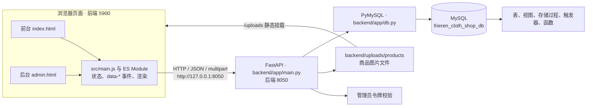
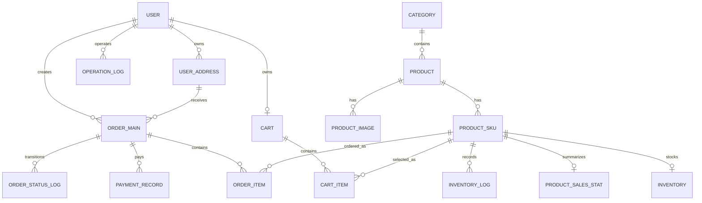
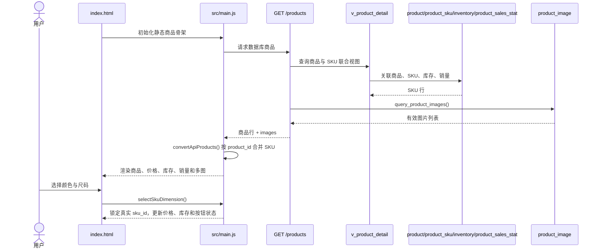
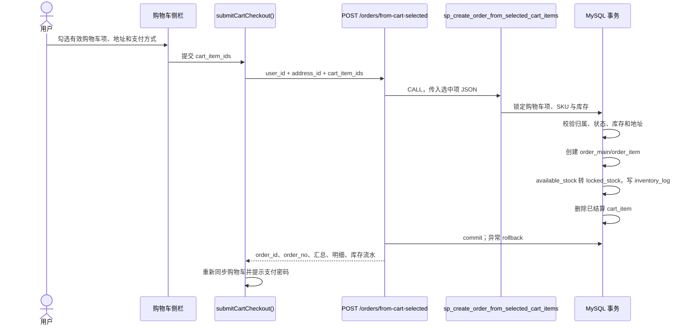
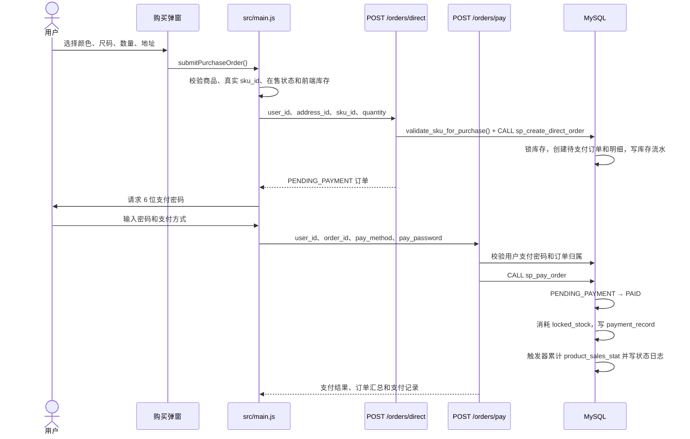
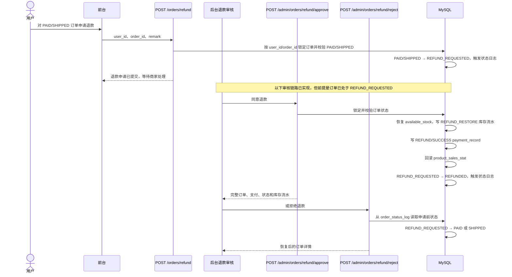
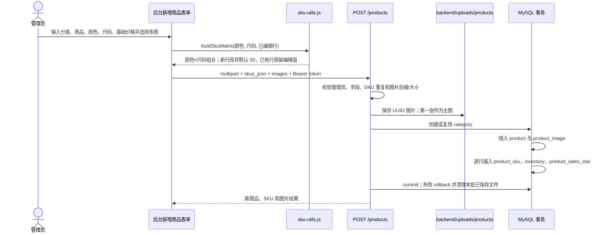
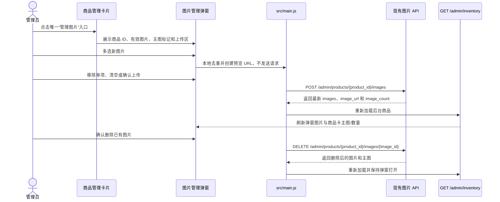

# Cloth-Shop 当前项目架构

- 文档生成日期：2026-07-15
- 当前分支：`master`
- 当前 commit：`cc87a3e`
- 项目技术栈：原生 HTML/CSS/JavaScript ES Module + FastAPI + PyMySQL + MySQL 8.0.28
- 数据库名称：`frieren_cloth_shop_db`
- 后端端口：`8050`
- 前端端口：`5900`
- 当前自动测试结果：`npm.cmd test` 共 110 项，110 项通过；指定 JavaScript 语法检查和 Python 编译检查均通过
- 文档基线：审计起始 commit 为 `cc87a3e`（`fix: 将新增商品 SKU 默认库存设为 50`）；本文档包含当前工作区待提交的后台商品图片管理入口合并

> 本文档描述当前代码快照。自动测试以纯函数行为和源码结构契约为主；既有退款轮次已连接本地 MySQL 并完成专用订单的 HTTP/数据库验证。本轮以浏览器自动操作验收统一图片管理弹窗的入口、已有图片、状态隔离和桌面/窄屏布局；受浏览器控制面文件选择能力限制，未执行多文件实际选择，也未执行真实图片上传、删除、数据库写入、迁移或并发测试。未单独实测的数据库业务链路仍以代码与 SQL 审计结论为准。

## 1. 项目概述

Cloth-Shop 是一个服装商城与进销存管理课程设计。前台承担商品浏览、SKU 选择、收藏、购物车、地址、下单、支付和订单记录；后台承担管理员认证、商品/SKU/图片/库存、订单发货、退款审核和销量统计。FastAPI 提供 HTTP 接口、鉴权、文件上传与事务编排，PyMySQL 连接 MySQL；MySQL 保存商品、库存、订单、支付、日志和销量，并通过视图、存储过程、触发器维护主要业务一致性。

## 2. 核心技术栈

| 层级 | 技术 | 主要职责 |
|---|---|---|
| 页面结构 | HTML | 定义前台、后台、弹窗、侧栏、表单和 `data-*` 交互入口 |
| 视觉层 | CSS | 统一前后台布局、响应式样式、状态和弹窗表现 |
| 浏览器逻辑 | JavaScript ES Module | 页面状态、事件绑定、API 调用、SKU 组合与本地兼容状态 |
| Web API | FastAPI | 路由、参数校验、管理员鉴权、文件上传、错误响应和事务编排 |
| 数据访问 | PyMySQL | 参数化 SQL、视图/存储过程调用、显式提交与回滚 |
| 数据库 | MySQL 8.0.28 | 业务数据、外键/检查约束、视图、存储过程、触发器和函数 |
| 自动测试 | Node.js `node:test` | 纯函数行为测试、HTML/CSS/JS/Python/SQL 源码契约断言 |
| 本地启动 | PowerShell + Batch | 同时启动 Uvicorn `8050` 与静态服务器 `5900`，等待端口就绪 |

## 3. 项目目录结构

```text
Cloth-Shop/
├─ index.html                         # 前台页面、购买弹窗、图片大图和个人中心侧栏
├─ admin.html                         # 后台登录、订单、商品、SKU、统一图片管理弹窗和统计面板
├─ src/
│  ├─ main.js                         # 前后台共享入口；DOM、状态、API 与图片待上传预览等主要业务交互
│  ├─ styles.css                      # 前后台共用样式和响应式规则
│  ├─ content.js                      # 静态文案、分类、17 个展示商品和旧 mock 种子
│  ├─ account-store.js                # localStorage 兼容数据、纯函数和旧后台 mock 辅助
│  ├─ account-state.js                # 未接入当前入口的旧账号/地址状态辅助
│  ├─ ranking.js                      # 销量解析、排序和排名格式化
│  ├─ product-ordering.js             # 商品可售判断和前台排序规则
│  └─ sku-utils.js                    # 颜色×尺码矩阵、SKU 选择和缺失组合生成
├─ backend/
│  ├─ app/
│  │  ├─ main.py                      # FastAPI 应用、全部路由、鉴权、上传、SQL 和事务
│  │  └─ db.py                        # `.env` 加载、PyMySQL 连接和连接上下文
│  ├─ requirements.txt                # Python 依赖清单
│  └─ uploads/products/               # 运行时商品图片目录；文档不枚举具体文件
├─ sql语句/
│  ├─ 01_数据库结构与增量迁移.sql     # 数据库、16 张表和复杂 SKU 增量字段
│  ├─ 02_视图.sql                     # 6 个业务视图及复杂 SKU 商品视图覆盖
│  ├─ 03_存储过程_触发器_函数.sql     # 11 个过程、3 个触发器和 1 个函数
│  ├─ 04_测试数据与验证.sql           # 测试数据、业务流程演示和一致性查询
│  └─ 05_账号与支付密码初始化.sql     # 支付密码字段/测试用户与管理员初始化
├─ tests/site.test.js                 # 110 项 Node.js 行为与源码结构测试
├─ start_dev.ps1                      # 双服务启动、端口等待和浏览器打开逻辑
├─ start_dev.bat                      # Windows 一键启动入口
├─ package.json                       # `node --test tests/site.test.js`
├─ README.md                          # 项目、初始化、启动和常见问题说明
└─ AGENTS.md                          # 仓库修改、数据库、测试和 Git 约束
```

## 4. 系统分层架构



前端通过 `python -m http.server 5900` 提供静态页面；FastAPI 在 `8050` 提供 API，并把 `backend/uploads` 挂载为 `/uploads`。数据库连接使用 `DictCursor`、`utf8mb4`、`autocommit=False`。

## 5. 前台模块

| 模块 | 页面入口 | JavaScript 核心函数/模块 | API | 数据库对象 |
|---|---|---|---|---|
| 商品加载 | `index.html` 的 `data-product-grid` | `loadProductsFromApi()`、`convertApiProducts()` | `GET /products` | `v_product_detail`、`product_image` |
| 商品搜索 | `data-product-search` | `getProductSearchText()`、`filteredProducts()` | 无；浏览器内过滤 | API 商品内存集合 |
| 商品排序 | 商品网格 | `compareProductsForCustomer()`、`getSalesRankMap()` | 无；浏览器内排序 | `product_sales_stat` 的 API 映射 |
| 多图预览 | 购买弹窗与 `data-image-lightbox` | `getProductImages()`、`renderImageLightbox()`、`showImageLightboxStep()` | 图片随 `GET /products` 返回 | `product_image`、兼容字段 `product.image_url` |
| SKU 选择 | `data-purchase-sku-options` | `getDimensionOptions()`、`selectSkuDimension()`、`setPurchaseDimension()` | SKU 随 `GET /products` 返回 | `product_sku`、`inventory` |
| 收藏 | 共用购买弹窗、个人中心收藏面板 | `upsertFavorite()`、`renderProductShelf()` | 当前未实现收藏 API | `localStorage: blue-song-favorites` |
| 加入购物车 | 共用购买弹窗 | `addCartToApi()`、`syncCartFromApi()` | `POST /cart/add`、`GET /cart/{user_id}` | `cart`、`cart_item`、`product_sku`、`inventory` |
| 购物车结算 | 个人中心购物车 | `submitCartCheckout()`、`createOrderFromSelectedCartFromApi()` | `POST /orders/from-cart-selected` | `cart_item`、`order_main`、`order_item`、`inventory`、`inventory_log` |
| 直接购买 | 共用购买弹窗 | `createDirectOrderFromApi()`、`submitPurchaseOrder()` | `POST /orders/direct` | `order_main`、`order_item`、`inventory`、`inventory_log` |
| 地址管理 | 个人中心地址面板 | `loadAddressesFromApi()`、`addAddressToApi()`、`setDefaultAddressToApi()`、`deleteAddressFromApi()` | `GET /addresses/user/{user_id}`、`POST /addresses/add`、`/set-default`、`/delete` | `user_address` |
| 订单记录 | 个人中心订单面板 | `loadOrdersFromApi()`、`renderApiOrders()`、`showOrderDetail()` | `GET /orders/user/{user_id}`、`GET /orders/{order_id}` | `v_order_summary`、`v_user_order_detail`、支付/状态/库存日志 |
| 支付 | 购买弹窗和待支付订单 | `payOrderFromApi()`、`payOrderWithPasswordPrompt()` | `POST /orders/pay` | `user.pay_password_hash`、`order_main`、`payment_record`、`inventory`、`product_sales_stat` |
| 取消订单 | 待支付订单操作 | `cancelOrderFromApi()`、`handleCancelOrder()` | `POST /orders/cancel` | `order_main`、`order_status_log`、`inventory`、`inventory_log` |
| 退款申请 | 已支付/已发货订单操作 | `refundOrderFromApi()`、`handleRefundOrder()` | `POST /orders/refund` | `order_main`、`order_status_log`；订单级请求只发送 `user_id`、`order_id`、`remark` |

重要页面契约包括 `data-product-id`、`data-product-sku-id`、`data-purchase-color`、`data-purchase-size`、`data-purchase-address-id`、`data-cart-select-id`、`data-cart-checkout`、`data-order-detail-id`、`data-order-pay-id`、`data-order-cancel-id` 和 `data-order-refund-id`。修改标记名必须同步检查 `index.html`、`src/main.js` 与 `tests/site.test.js`。

## 6. 后台模块

| 模块 | 页面入口 | JavaScript 核心函数/模块 | API | 数据库对象 |
|---|---|---|---|---|
| 管理员登录 | `data-admin-login-form` | `loginAdmin()`、`renderAdminAuthState()` | `POST /admin/login` | `user` |
| 登录状态恢复 | 页面初始化 | `getStoredAdminSession()`、`requireAdminSessionBeforeLoading()`、`adminFetch()` | 通过首批受保护 API 验证，无独立 `/admin/me` | `sessionStorage` + `user` |
| 商品搜索和筛选 | 商品管理面板 | `getFilteredAdminProductRows()`、后台 `renderProducts()` | 无新增请求；内存过滤 | `GET /admin/inventory` 已加载结果 |
| 新增商品 | `data-admin-product-form` | `buildSkuMatrix()`、`createAdminProductToApi()`；新生成 SKU 默认库存 50，仍可逐行编辑 | `POST /products` | `category`、`product`、`product_sku`、`inventory`、`product_sales_stat`、`product_image` |
| SKU 管理 | `data-admin-sku-manager` | `loadAdminProductSkusToApi()`、`createAdminProductSkusToApi()`、`updateAdminProductSkuToApi()`、`deleteAdminProductSkuToApi()` | `GET/POST /admin/products/{product_id}/skus`、`PATCH/DELETE /admin/products/{product_id}/skus/{sku_id}` | `product_sku`、`inventory`、`product_sales_stat` |
| 库存更新 | 商品卡和 SKU 管理器 | `updateAdminSkuStockToApi()` | `POST /admin/inventory/update-stock` | `inventory` |
| 商品上下架 | 商品管理面板 | `updateAdminProductStatusToApi()` | `POST /admin/products/update-status` | `product`、`product_sku` |
| 商品逻辑删除 | 商品管理面板 | `deleteAdminProductToApi()` | `POST /admin/products/delete` | `product.is_deleted`、`product_sku.is_deleted` |
| 图片查看、追加和删除 | 商品卡唯一的 `data-admin-product-image-manage` 入口与 `data-admin-image-manager` 弹窗 | `renderAdminProductImageManager()`、`submitAdminImageManagerUpload()`、`appendAdminProductImagesToApi()`、`deleteAdminProductImageToApi()` | `POST/DELETE /admin/products/{product_id}/images...` | `product_image`、兼容主图 `product.image_url` |
| 后台订单 | 订单面板 | `loadAdminOrdersFromApi()`、`renderAdminOrderDetail()` | `GET /admin/orders`、`GET /admin/orders/{order_id}` | `v_order_summary`、`v_user_order_detail`、支付/状态/库存日志 |
| 发货和取消发货 | 订单操作列 | `shipAdminOrderToApi()`、`unshipAdminOrderToApi()` | `POST /admin/orders/ship`、`/unship` | `order_main`、`order_status_log` |
| 退款同意和拒绝 | 退款待处理订单 | `approveAdminRefundToApi()`、`rejectAdminRefundToApi()` | `POST /admin/orders/refund/approve`、`/reject` | `order_main`、`inventory`、`inventory_log`、`payment_record`、`product_sales_stat` |
| 销量统计 | 销量统计面板 | `refreshAdminStatsFromApi()`、`convertApiStatsToRenderedStats()` | `GET /admin/stats` | `order_main`、`order_item`、`product`、`v_product_sales_rank` |
| 操作日志现状 | 当前无独立页面 | 订单详情只展示状态日志和库存流水 | 当前无 `operation_log` API | `operation_log` 仅有 SQL 测试数据，运行时未读写 |

后台导航当前只有订单查看、商品管理、新增商品、销量统计四项。商品接口失败且不是 401/403 时，前端仍可能回退到 `localStorage` 的 mock 商品，这是数据库权威数据源方向下需要收敛的兼容逻辑。

## 7. 后端 API 结构

### 商品与 SKU

| 方法 | 路径 | 作用 | 权限 | 主要数据库对象 |
|---|---|---|---|---|
| GET | `/products` | 查询商品、结构化 SKU、库存、销量和图片 | 公开 | `v_product_detail`、`product_image` |
| POST | `/products` | multipart 新增商品、复杂 SKU、库存和图片 | 管理员 Bearer 令牌 | `category`、`product`、`product_sku`、`inventory`、`product_sales_stat`、`product_image` |
| GET | `/admin/products/{product_id}/skus` | 查询商品全部 SKU（含逻辑删除项） | 管理员 Bearer 令牌 | `product_sku`、`inventory` |
| POST | `/admin/products/{product_id}/skus` | 批量新增缺失 SKU 组合 | 管理员 Bearer 令牌 | `product_sku`、`inventory`、`product_sales_stat` |
| PATCH | `/admin/products/{product_id}/skus/{sku_id}` | 修改维度、价格、库存和在售状态 | 管理员 Bearer 令牌 | `product_sku`、`inventory` |
| DELETE | `/admin/products/{product_id}/skus/{sku_id}` | 逻辑删除 SKU，禁止删除最后一个有效 SKU | 管理员 Bearer 令牌 | `product_sku` |

### 图片

| 方法 | 路径 | 作用 | 权限 | 主要数据库对象 |
|---|---|---|---|---|
| POST | `/admin/products/{product_id}/images` | 向已有商品追加多张图片 | 管理员 Bearer 令牌 | `product`、`product_image` |
| DELETE | `/admin/products/{product_id}/images/{image_id}` | 逻辑删除图片；删除主图时提升下一张 | 管理员 Bearer 令牌 | `product`、`product_image` |

当前没有独立图片查询 API；图片数组附加在商品/后台库存响应中。后台商品卡只保留“管理图片”入口，弹窗统一查看已有图片、选择与预览待上传图片、确认上传和删除；上传、删除成功后均重新加载 `GET /admin/inventory`，同步刷新弹窗和商品卡。当前仍没有手动指定任意图片为主图的 API。

### 购物车

| 方法 | 路径 | 作用 | 权限 | 主要数据库对象 |
|---|---|---|---|---|
| GET | `/cart/{user_id}` | 查询用户购物车与实时 SKU/库存状态 | 未做用户令牌校验 | `cart`、`cart_item`、`product_sku`、`product`、`inventory` |
| POST | `/cart/add` | 添加 SKU；同 SKU 累加数量 | 未做用户令牌校验 | `sp_add_to_cart`、`cart`、`cart_item` |
| POST | `/cart/update-quantity` | 修改购物车项数量并校验归属/库存 | 未做用户令牌校验 | `sp_update_cart_item_quantity`、`cart_item`、`inventory` |
| POST | `/cart/delete-item` | 删除指定购物车项 | 未做用户令牌校验 | `sp_delete_cart_item`、`cart_item` |

### 地址

| 方法 | 路径 | 作用 | 权限 | 主要数据库对象 |
|---|---|---|---|---|
| GET | `/addresses/user/{user_id}` | 查询未删除地址 | 未做用户令牌校验 | `user_address` |
| POST | `/addresses/add` | 新增地址，可设为默认 | 未做用户令牌校验 | `user_address` |
| POST | `/addresses/set-default` | 切换默认地址 | 未做用户令牌校验 | `sp_set_default_address`、`user_address` |
| POST | `/addresses/delete` | 逻辑删除地址 | 未做用户令牌校验 | `sp_delete_user_address`、`user_address` |

### 订单与支付

| 方法 | 路径 | 作用 | 权限 | 主要数据库对象 |
|---|---|---|---|---|
| POST | `/orders/from-cart` | 整个购物车创建待支付订单 | 未做用户令牌校验 | `sp_create_order_from_cart`、订单/购物车/库存表 |
| POST | `/orders/from-cart-selected` | 仅用选中购物车项创建订单 | 未做用户令牌校验 | `sp_create_order_from_selected_cart_items`、订单/购物车/库存表 |
| POST | `/orders/direct` | 校验 SKU 后直接创建待支付订单 | 未做用户令牌校验 | `sp_create_direct_order`、`order_main`、`order_item`、`inventory` |
| POST | `/orders/pay` | 校验订单归属和 6 位支付密码后支付 | 未做用户令牌校验 | `user`、`sp_pay_order`、`payment_record`、`inventory`、`product_sales_stat` |
| POST | `/orders/cancel` | 取消待支付订单并释放锁定库存 | 未做用户令牌校验 | `sp_cancel_order`、`order_main`、`inventory`、日志表 |
| GET | `/orders/user/{user_id}` | 查询用户订单列表 | 未做用户令牌校验 | `v_order_summary` |
| GET | `/orders/{order_id}` | 查询订单、支付、状态和库存流水 | 未做用户令牌校验 | `v_order_summary`、`v_user_order_detail`、日志表 |

### 退款

| 方法 | 路径 | 作用 | 权限 | 主要数据库对象 |
|---|---|---|---|---|
| POST | `/orders/refund` | 锁定归属订单，将已支付/已发货订单改为退款待处理 | 未做用户令牌校验；按请求体 `user_id` 校验订单归属 | `order_main`、`order_status_log` |
| POST | `/admin/orders/refund/approve` | 恢复库存、记录退款、回滚销量并完成退款 | 管理员 Bearer 令牌 | `order_main`、`inventory`、`inventory_log`、`payment_record`、`product_sales_stat` |
| POST | `/admin/orders/refund/reject` | 恢复退款申请前的 `PAID` 或 `SHIPPED` | 管理员 Bearer 令牌 | `order_main`、`order_status_log` |

### 管理员认证

| 方法 | 路径 | 作用 | 权限 | 主要数据库对象 |
|---|---|---|---|---|
| POST | `/admin/login` | 校验管理员邮箱、密码、管理员标记并签发 8 小时令牌 | 公开登录入口 | `user` |

当前未实现 `/admin/me`、服务器端 token 存储、撤销列表或登出 API。

### 后台商品

| 方法 | 路径 | 作用 | 权限 | 主要数据库对象 |
|---|---|---|---|---|
| GET | `/admin/inventory` | 查询未删除商品的全部 SKU、库存、销量和图片 | 管理员 Bearer 令牌 | `v_product_detail`、`product_image` |
| POST | `/admin/inventory/update-stock` | 锁定库存行后修改 `available_stock` | 管理员 Bearer 令牌 | `product_sku`、`inventory` |
| POST | `/admin/products/update-status` | 同步上下架商品和全部有效 SKU | 管理员 Bearer 令牌 | `product`、`product_sku` |
| POST | `/admin/products/delete` | 逻辑删除商品和全部有效 SKU | 管理员 Bearer 令牌 | `product`、`product_sku` |

### 后台订单

| 方法 | 路径 | 作用 | 权限 | 主要数据库对象 |
|---|---|---|---|---|
| GET | `/admin/orders` | 查询全部订单 | 管理员 Bearer 令牌 | `v_order_summary` |
| GET | `/admin/orders/{order_id}` | 查询订单完整详情 | 管理员 Bearer 令牌 | `v_order_summary`、`v_user_order_detail`、支付/状态/库存日志 |
| POST | `/admin/orders/ship` | `PAID → SHIPPED` | 管理员 Bearer 令牌 | `order_main`、`order_status_log` |
| POST | `/admin/orders/unship` | `SHIPPED → PAID` | 管理员 Bearer 令牌 | `order_main`、`order_status_log` |

### 统计

| 方法 | 路径 | 作用 | 权限 | 主要数据库对象 |
|---|---|---|---|---|
| GET | `/admin/stats` | 汇总订单、销售额、件数、商品数和 SKU 销量排行 | 管理员 Bearer 令牌 | `order_main`、`order_item`、`product`、`v_product_sales_rank` |

## 8. 数据库结构

### 8.1 核心表

| 表 | 作用 | 关键关系 |
|---|---|---|
| `user` | 普通用户、管理员和密码/支付密码载体 | 被地址、购物车、订单、操作日志引用；`email` 唯一 |
| `user_address` | 用户收货地址、默认地址和逻辑删除 | `user_id → user.id`；被订单引用 |
| `category` | 商品分类与排序 | 被 `product.category_id` 引用；`name` 唯一 |
| `product` | 商品主数据、状态和兼容主图 | 属于分类；被 SKU、图片引用 |
| `product_image` | 商品多图、主图、排序和逻辑删除 | `product_id → product.id` |
| `product_sku` | SKU 编码、名称、颜色、尺码、价格、状态 | `product_id → product.id`；被库存、购物车、订单、销量引用 |
| `inventory` | 每个 SKU 的可用库存和锁定库存 | `sku_id → product_sku.id` 且唯一 |
| `cart` | 用户活动购物车 | `user_id → user.id` 且唯一 |
| `cart_item` | 购物车 SKU 与数量 | 引用 `cart`、`product_sku`；`(cart_id, sku_id)` 唯一 |
| `order_main` | 订单号、用户、地址、状态和总金额 | 引用 `user`、`user_address`；`order_no` 唯一 |
| `order_item` | 下单时的 SKU、数量和成交价快照 | 引用 `order_main`、`product_sku` |
| `payment_record` | 支付和退款记录 | `order_id → order_main.id` |
| `order_status_log` | 订单状态迁移日志 | `order_id → order_main.id` |
| `inventory_log` | SKU 库存变化流水 | `sku_id → product_sku.id`，`ref_no` 关联业务单号 |
| `operation_log` | 操作人、动作类型和备注 | `operator_id → user.id`；当前仅测试数据使用 |
| `product_sales_stat` | SKU 累计销量和销售额 | `sku_id` 同时是主键和外键，一 SKU 一行 |

主要唯一约束还包括 `cart.user_id`、`inventory.sku_id`、`cart_item(cart_id, sku_id)`；复杂 SKU 增量增加 `sku_code` 与 `(product_id, color_name, size_name, is_deleted)` 查询索引，但 SQL 未声明 `sku_code` 或颜色尺码组合的数据库唯一约束，唯一性主要由后端事务内查询校验。

### 8.2 实体关系图



### 8.3 视图、存储过程与触发器

#### 视图

| 名称 | 用途 | 关联业务 |
|---|---|---|
| `v_product_detail` | 商品、SKU、库存、销量的联合明细；最终版本包含颜色、尺码和库存更新时间 | 前台商品、后台库存 |
| `v_user_cart_detail` | 用户购物车、商品、SKU、金额与库存 | 购物车展示 |
| `v_user_order_detail` | 订单、地址、明细、商品、SKU 和支付联合详情 | 前后台订单详情 |
| `v_inventory_status` | 可用/锁定/总库存和库存状态 | 后台库存、库存预警 |
| `v_product_sales_rank` | 按 SKU 销量和销售额计算排名 | 首页排名、后台统计 |
| `v_order_summary` | 订单品类数、件数和金额汇总 | 前后台订单列表、统计 |

#### 存储过程

| 名称 | 用途 | 关联业务 |
|---|---|---|
| `sp_add_to_cart` | 创建购物车或累加同 SKU 数量 | 加入购物车 |
| `sp_create_order_from_cart` | 整车下单、锁定库存、生成明细、清空购物车 | 购物车结算 |
| `sp_create_order_from_selected_cart_items` | 只结算选中购物车项 | 当前前台购物车结算 |
| `sp_create_direct_order` | 不经过购物车直接创建待支付订单 | 立即购买 |
| `sp_pay_order` | 支付订单、消耗锁定库存、写支付记录 | 支付、销量 |
| `sp_cancel_order` | 取消待支付订单并释放锁定库存 | 取消订单 |
| `sp_update_cart_item_quantity` | 校验用户、库存后修改数量 | 购物车改量 |
| `sp_delete_cart_item` | 删除用户购物车项 | 购物车删除 |
| `sp_set_default_address` | 清除旧默认并设置新默认地址 | 地址管理 |
| `sp_delete_user_address` | 逻辑删除地址 | 地址管理 |
| `sp_refund_paid_order` | 旧的已支付订单退款过程 | 当前 FastAPI 未调用；退款审核由 Python 事务实现 |

#### 触发器与函数

| 名称 | 类型 | 用途 |
|---|---|---|
| `trg_order_main_after_insert` | 触发器 | 新订单插入后写入初始状态日志 |
| `trg_order_main_after_update` | 触发器 | 状态变化后写日志；状态转为 `PAID` 时维护销量 |
| `trg_inventory_before_update` | 触发器 | 阻止可用库存或锁定库存更新为负数 |
| `fn_get_stock_status` | 函数 | 将可用库存转换为缺货、低库存或正常状态 |

### 8.4 SQL 初始化顺序

1. `sql语句/01_数据库结构与增量迁移.sql`：创建数据库、15 张基础表、`product_image` 扩展表，并增加复杂 SKU 字段与索引。
2. `sql语句/02_视图.sql`：创建 6 个业务视图，最后用复杂 SKU 版本覆盖 `v_product_detail`。
3. `sql语句/03_存储过程_触发器_函数.sql`：创建购物车、订单、支付、取消、地址和退款过程，以及状态/库存触发器和库存状态函数。
4. `sql语句/04_测试数据与验证.sql`：清理并写入固定测试数据，执行下单/支付/取消演示和一致性查询；只应在测试数据库使用。
5. `sql语句/05_账号与支付密码初始化.sql`：补充支付密码哈希字段，初始化测试用户支付密码与管理员账号。

从零初始化时必须按以上顺序执行。`04` 当前是固定规模演示数据（16 商品、32 SKU、8 订单等），不是大量销售压力数据。

## 9. 核心业务链路

### 9.1 商品加载与 SKU 选择



### 9.2 购物车结算



`POST /orders/from-cart` 及 `createOrderFromCartFromApi()` 仍存在，但当前 UI 使用选中项接口。

### 9.3 直接购买与支付



### 9.4 退款审核



退款申请与后台审核沿用两阶段状态机：申请阶段只进入 `REFUND_REQUESTED`，不恢复库存、不回滚销量、不写退款成功记录；管理员同意后才执行退款一致性处理，拒绝时恢复申请前状态。

### 9.5 商品新增与复杂 SKU



后台新建商品时，新生成的颜色 × 尺码 SKU 默认库存为 50；管理员仍可逐行改为包括 0 在内的非负整数，提交时 `skus_json` 使用界面中的实际值。已有商品在“管理规格”中新增缺失组合仍沿用默认库存 0，本轮未改变数据库 `inventory.available_stock` 的安全默认值或后端库存规则。

### 9.6 后台商品图片管理



待上传文件只存在于当前弹窗内存状态，以文件名、大小、`lastModified` 和 MIME 类型组合去重。单项移除、清空、上传成功、关闭弹窗和页面卸载都会释放本地对象 URL；关闭后打开其他商品不会沿用文件或反馈。数据库结构、API 路径、字段、逻辑删除和删除主图后的自动提升规则均未改变。图片逻辑删除仍不会自动清理磁盘文件。

## 10. 数据来源与状态管理

| 数据来源 | 当前职责 | 权威性与限制 |
|---|---|---|
| MySQL | 商品/SKU/库存、数据库购物车、地址、订单、支付、退款审核、销量、状态与库存流水 | 核心交易数据权威来源；本轮未连接真实数据库验证 |
| `sessionStorage` | 保存 `cloth_shop_admin_session`（管理员 ID、邮箱、token） | 仅浏览器会话；刷新后由首批受保护请求间接验证，无 `/admin/me` |
| `localStorage` | 前台本地账号资料、收藏、购物车快照、购物车勾选项；旧后台商品/mock 订单 | 收藏和前台账号仍以本地为准；购物车商品以数据库为业务源但 UI 使用回读快照；后台 API 失败仍有 mock 回退 |
| `src/content.js` | 品牌文案、分类、17 个静态商品、展示图片、旧 mock 订单种子 | API 失败时用于视觉兜底和测试，不包含可购买的真实 SKU/库存 |
| `backend/uploads/products` | 新增和追加商品图片文件 | 数据库保存访问路径；删除图片当前只逻辑删数据库记录，不删除磁盘文件 |
| `src/account-store.js` | 本地存储、金额/排名展示纯函数和旧 mock 辅助 | 当前仍被前台收藏/缓存与后台失败回退使用，不能视为已完全淘汰 |
| `src/account-state.js` | 重复的注册、地址、profile 辅助 | 当前未被页面入口或 `main.js` 导入 |

已迁移到数据库的主要业务包括商品/SKU/库存、购物车增删改、地址、订单、支付、后台商品、后台订单与销量统计。仍属本地或兼容逻辑的包括普通用户登录/注册资料、收藏、购物车勾选项、数据库购物车的 UI 快照、静态商品视觉兜底、旧后台 mock 商品/订单辅助。

## 11. 权限与数据一致性

- **管理员登录和令牌**：`POST /admin/login` 通过邮箱、MySQL `SHA2` 密码和 `is_admin` 校验；令牌是 `admin_user_id:expires_at:HMAC-SHA256` 的 URL-safe Base64，默认 8 小时。密钥当前硬编码在后端源码中。
- **后台接口权限**：后台商品、SKU、图片、库存、订单和统计接口调用 `require_admin_user()`，要求 Bearer token，并重新查询用户的管理员/删除状态。
- **普通用户权限限制**：前台交易接口没有普通用户 token；大量接口直接信任路径或请求体中的 `user_id`。`GET /orders/{order_id}` 也没有订单归属认证。这是课程演示实现，不是生产级权限模型。
- **401/403 行为**：前端 `adminFetch()` 能识别 401/403，三个主要列表刷新路径会清会话和后台数据；部分后端列表接口的通用异常捕获可能把鉴权异常包装为 500，部分局部操作也不会立即触发统一退出。
- **逻辑删除**：商品、SKU、图片、地址均保留历史数据；商品删除同步将有效 SKU 下架并标记删除，SKU 删除禁止删除最后一个有效 SKU。
- **SKU 与库存校验**：下单前后端均检查真实 `sku_id`、商品/SKU 状态和可用库存；存储过程锁定行，库存触发器阻止负库存。
- **订单状态**：核心状态包括 `PENDING_PAYMENT`、`PAID`、`CANCELLED`、`SHIPPED`、`REFUND_REQUESTED`、`REFUNDED`；状态变化由触发器写 `order_status_log`。代码中也有 `COMPLETED` 显示文案，但当前没有完成订单的 API。
- **支付**：支付校验订单归属和 6 位支付密码，调用 `sp_pay_order`，在事务中释放锁定库存、写支付记录并联动销量。
- **退款**：管理员同意退款的库存恢复、支付记录、销量回滚和状态更新位于同一事务；拒绝退款从状态日志恢复申请前状态。
- **退款申请**：`RefundOrderRequest` 定义 `user_id`、`order_id`、`remark`；`refund_order()` 按订单归属锁定 `order_main`，只允许 `PAID` 或 `SHIPPED` 进入 `REFUND_REQUESTED`，并保留明确的非法状态错误与事务回滚。
- **事务与回滚**：PyMySQL 关闭自动提交；商品/图片/SKU/订单/支付/退款/库存/状态写操作显式 `commit()`，异常路径 `rollback()`。商品图片在数据库事务失败时清理本批新文件，但图片逻辑删除不会清理磁盘文件。
- **操作审计限制**：`operation_log` 有表结构和测试数据，却没有后端读写/API/页面；管理员接口返回的部分 `action_type` 也没有落库。

## 12. 测试体系

### 当前实际结果

| 命令 | 结果 |
|---|---|
| `npm.cmd test` | 110/110 通过，0 失败、0 跳过、0 TODO |
| `node --check src/main.js` | 通过 |
| `node --check src/sku-utils.js` | 通过 |
| `node --check src/product-ordering.js` | 通过 |
| `node --check src/ranking.js` | 通过 |
| `backend/.venv/Scripts/python.exe -m py_compile backend/app/main.py` | 通过 |
| `backend/.venv/Scripts/python.exe -m py_compile backend/app/db.py` | 通过 |
| 浏览器自动操作新增商品 SKU 表单 | 2 色×3 尺码生成 6 行且均为 50；人工改为 35 后新增尺码，旧值保留、新行 50；库存可改为 0；未提交商品，控制台 0 错误 |
| 浏览器自动操作统一图片管理弹窗 | 34 张商品卡各只有一个“管理图片”入口；旧入口为 0；弹窗商品/图片/主图/空上传状态正确；关闭后切换商品无状态串用；1280px 与 390px 均无横向溢出；控制台 0 错误；未真实上传或删除 |

### 已覆盖模块

- 直接执行 `content.js`、`ranking.js`、`product-ordering.js`、`account-store.js`、`sku-utils.js` 的纯函数行为。
- 覆盖销量排名、可售优先排序、地址迁移/本地存储、购物车金额、注册校验、SKU 笛卡尔积、新增商品 SKU 默认库存 50、矩阵重建时保留人工库存、已有商品缺失组合仍默认 0、颜色尺码选择和不可售组合禁用，以及后台图片唯一入口、弹窗上传控件、本地待上传状态、对象 URL 释放、空列表/上传锁和刷新契约。
- 读取 `index.html`、`admin.html`、`src/main.js`、`src/styles.css`、后端 Python、SQL、README 和启动脚本，断言路由字符串、`data-*` 钩子、字段、CORS、端口、图片、认证、订单和 SKU 结构。

110 项中相当一部分是 `readFileSync(...).includes(...)` 或正则形式的源码结构断言；它们能锁定契约，但不是浏览器或 API 端到端测试。

### 尚未覆盖或本轮未执行

- **自动化 HTTP 冒烟测试**：尚未纳入测试套件。项目有 `/`、`/db-test` 和 `/docs`，但 `tests/site.test.js` 没有 `fetch` 请求；本轮退款接口验证是人工调用本地 API。
- **真实 API 测试范围**：本轮已覆盖退款申请成功、待支付状态拦截、订单归属拦截、重复申请以及管理员同意；尚未覆盖 422、401/403、库存冲突、上传失败和其他接口的完整状态矩阵。
- **真实数据库测试**：本轮已连接 MySQL 8.0.28，以专用订单验证待支付拦截、归属拦截、支付后申请、重复申请和管理员同意；未执行迁移、故障注入回滚或并发库存测试。
- **浏览器测试**：测试套件没有 Playwright、Puppeteer、Selenium 或 jsdom；既有轮次验收了新增商品 SKU 矩阵，本轮验收了统一图片管理弹窗的入口、已有图片、主图标记、空上传状态、关闭/切换清理及桌面/窄屏布局。当前浏览器控制面不支持向文件 input 设置本地文件，因此多文件实际预览、单项移除和清空未在浏览器中执行；真实上传和删除为避免污染现有图片也未执行。
- **退款回归**：已覆盖请求模型字段、退款路由不读取 SKU 字段、不调用购买校验、订单归属锁、允许状态、状态更新、提交/回滚、业务错误保留以及前端订单级请求体。

## 13. 本地启动流程

1. 启动 MySQL 8.0，并确认将使用 `frieren_cloth_shop_db`。
2. 按第 8.4 节顺序执行 `sql语句/` 下 5 个整理版 SQL。`04` 会清空并重建测试数据，只能用于测试库。
3. 在 `backend/.env` 配置 `DB_HOST`、`DB_PORT`、`DB_USER`、`DB_PASSWORD`、`DB_NAME`；不要提交或公开该文件。
4. 若虚拟环境不存在，在仓库根目录执行 `python -m venv backend/.venv`。
5. 安装依赖：`backend\.venv\Scripts\python.exe -m pip install -r backend\requirements.txt`。
6. 在仓库根目录执行 `start_dev.bat`，或执行 `powershell -ExecutionPolicy Bypass -File .\start_dev.ps1`。
7. 后端 API：`http://127.0.0.1:8050`。
8. 前台：`http://127.0.0.1:5900/index.html`。
9. 后台：`http://127.0.0.1:5900/admin.html`；Swagger：`http://127.0.0.1:8050/docs`。
10. 手动启动时，后端工作目录必须是 `backend`：`backend\.venv\Scripts\python.exe -m uvicorn app.main:app --reload --port 8050`；前端工作目录是仓库根目录：`backend\.venv\Scripts\python.exe -m http.server 5900`。

常见问题：MySQL 未启动或 `.env` 配置不匹配；`8050`/`5900` 被旧进程占用；虚拟环境缺包；SQL 未按顺序执行导致视图/过程缺失；浏览器缓存旧 ES Module；上传目录无写权限。`POST /products` 使用 multipart，而 `backend/requirements.txt` 当前未显式列出 `python-multipart`，新环境若在表单路由加载时报依赖错误，需要先核对实际安装环境和依赖清单。`backend/uploads` 当前未被 `.gitignore` 排除，新上传文件应避免误提交。

## 14. 高耦合文件与修改边界

| 文件 | 高耦合原因 | 修改时必须联动检查 |
|---|---|---|
| `src/main.js` | 同时包含前台、后台、DOM、状态、API 和兼容逻辑 | 两个 HTML 的 `data-*`、所有 API 字段、local/sessionStorage、SKU 工具、订单/图片/认证回归测试 |
| `backend/app/main.py` | 单文件包含 38 个路由、模型、上传、鉴权、SQL 和事务 | Pydantic 模型、前端请求、SQL 对象、状态机、提交/回滚、错误码和上传清理 |
| `src/styles.css` | 前后台共用且大量状态类依赖 JS | 响应式布局、隐藏/活动状态、弹窗、侧栏、管理面板和测试中的选择器断言 |
| `tests/site.test.js` | 同时覆盖纯函数与大量源码字符串契约 | 修改路径、函数名、字段、端口、文案、`data-*` 或 SQL 时区分行为测试与结构断言 |
| `sql语句/01-05` 整理版 | 表、视图、过程、触发器、测试数据和账号初始化按序耦合 | 新增增量迁移、外键/索引、最终覆盖视图、过程重建、测试数据与 README 执行顺序 |

禁止因文件体积大而整体重写。跨层功能应按“页面 → `data-*` → `main.js` → API → Pydantic → SQL/过程/事务 → 响应 → 重渲染”逐段验证。

## 15. 当前完成度与后续开发

### 已形成完整闭环

- **复杂 SKU**：颜色×尺码生成、真实 SKU ID、价格/库存/状态选择、后台增删改和逻辑删除链路齐全；新建商品的新组合默认库存为 50，矩阵重建保留已有编辑值，已有商品新增缺失组合仍默认 0。
- **多图片**：多图上传、数据库图片列表、主图兼容、前台缩略图/大图和逻辑删除链路齐全；后台商品卡只保留“管理图片”入口，统一弹窗承担已有图片查看、新图片选择与本地预览、单项移除、清空、确认上传和删除。
- **购物车与下单**：数据库购物车增删改、选中项结算、直接购买、待支付订单、取消订单和库存锁定/释放链路齐全。
- **后台订单**：订单列表/详情、发货、取消发货、状态日志和库存流水展示链路齐全。
- **销量**：支付累计、退款回滚和后台统计代码链路齐全。
- **退款申请与审核**：订单级申请、归属与状态校验、`REFUND_REQUESTED` 状态日志、重复申请拦截、后台同意/拒绝及退款一致性处理链路齐全；本轮已用专用订单完成真实 MySQL/API 的支付后申请与管理员同意验证。

以上结论主要来自当前代码与 SQL 结构；退款申请和管理员同意分支已完成真实数据库/API 验收，新增商品 SKU 默认库存已完成浏览器表单验收，其他浏览器交互仍未完整验收。

### 基本完成但需要真实业务验收

- **支付**：支付密码、订单归属、支付记录、库存和销量链路存在，需要在真实 MySQL 中验证成功、错误密码、重复支付和事务回滚。
- **图片文件一致性**：新增失败能清理本批文件，但逻辑删除不删磁盘文件，需要验收长期文件治理。
- **管理员认证**：登录、恢复、退出和主要 401/403 清理存在，需要验证异常包装为 500 的接口和令牌过期行为。
- **SQL 初始化与业务过程**：`04` 提供演示流程和一致性查询，但本轮未实际执行 SQL。

### 尚未完成

- 普通用户没有真实登录/注册 API 和用户 token；当前账号资料是本地存储，交易使用固定测试用户 ID。
- `operation_log` 没有运行时写入、查询 API 或后台页面，不能作为管理员审计闭环。
- 没有订单“完成/确认收货”API；仅存在 `COMPLETED` 显示文案。
- 没有手动设置任意商品图片为主图的接口。
- 没有自动化 HTTP、自动化真实数据库、并发事务或浏览器端到端测试；当前真实数据库验证仅覆盖本轮退款专用订单场景。
- `04` 只有固定规模测试数据，不是大量销售、压力或容量测试数据。
- 当前仓库没有完成可直接交付的课程报告、PPT 和讲解视频闭环。

### 可以延后优化

- 在保持接口兼容的前提下拆分 `src/main.js` 与 `backend/app/main.py` 的职责。
- 收敛后台数据库失败时的 mock 商品回退，并清理未接入的 `account-state.js`、旧本地订单/商品辅助。
- 增加服务器端 token 管理、普通用户鉴权和细粒度资源归属校验。
- 补充上传文件内容检测、磁盘孤儿文件清理、操作日志落库与查询页面。
- 建立可自动清理的 API/数据库 fixture、浏览器测试和大批量销售数据生成工具。
- 在功能和测试基线稳定后，从本文档提取课程报告、PPT 与讲解视频素材。

## 16. 文档维护规则

出现以下任一变化时必须更新本文档：

- 新增、删除或移动核心文件；
- API 方法、路径、请求/响应字段或权限变化；
- 数据库表、字段、外键、索引、视图、过程、触发器或函数变化；
- `sql语句/` 初始化顺序或测试数据规模变化；
- 前端 `5900`、后端 `8050` 或数据库连接方式变化；
- 新增、删除或修复核心业务闭环；
- 管理员/普通用户鉴权与 token 策略变化；
- 数据权威来源、localStorage/sessionStorage 或 mock 回退策略变化；
- 自动测试数量、覆盖范围、命令或结果口径变化。

更新时必须重新记录分支、commit、日期和真实测试结果，并以当前代码、SQL 和运行证据为准，不沿用旧计划或历史对话结论。

本文档是当前代码结构快照，不代替 README、数据库设计文档或测试报告。
