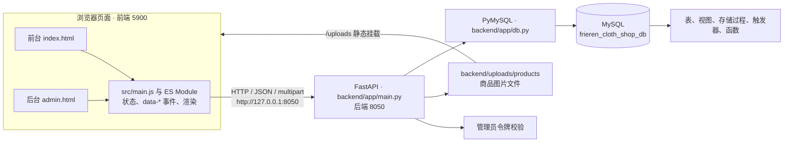
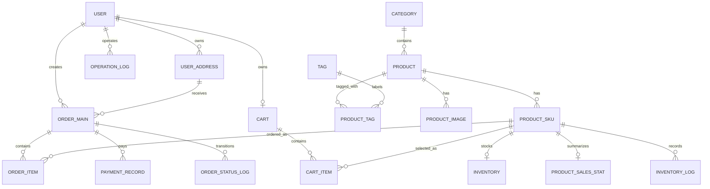
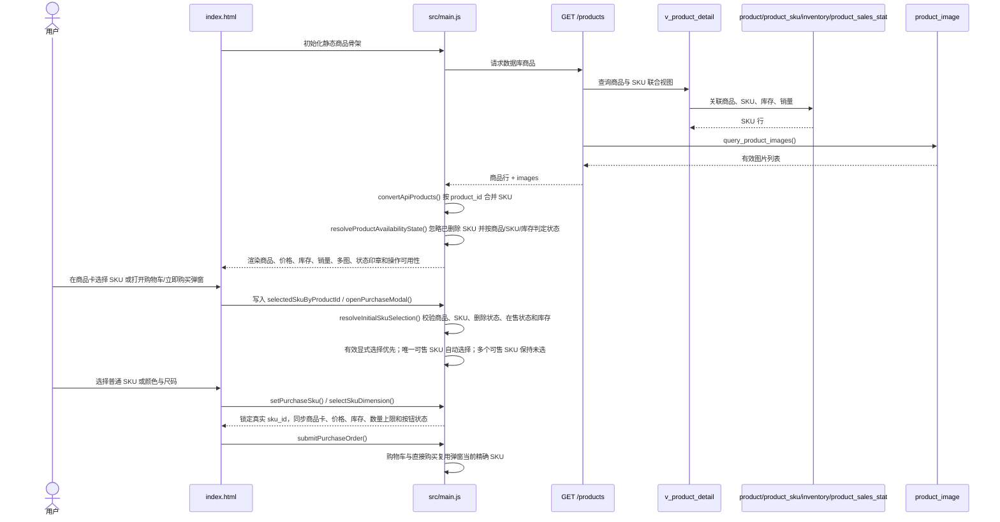
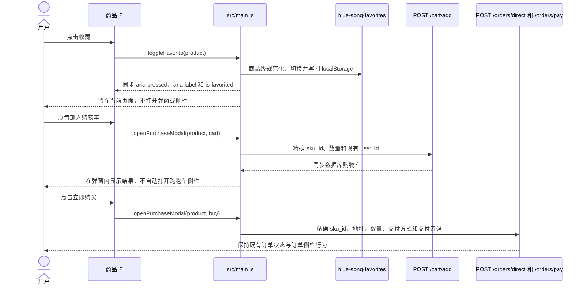
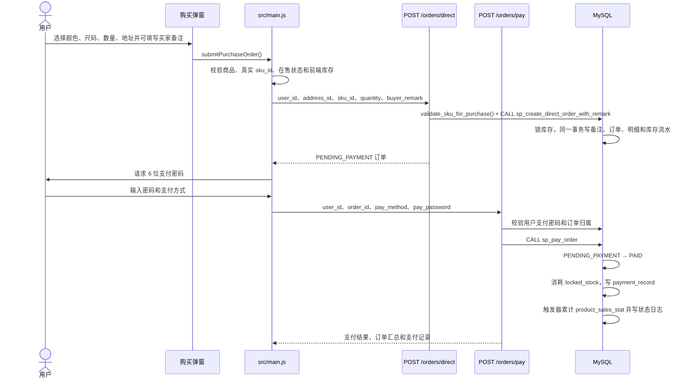
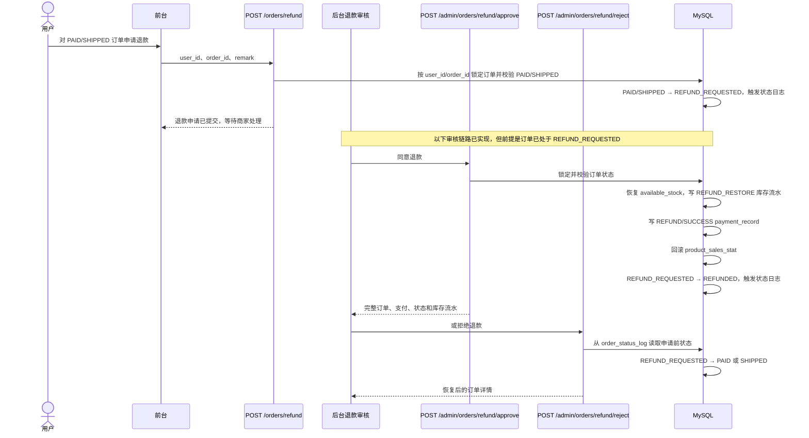
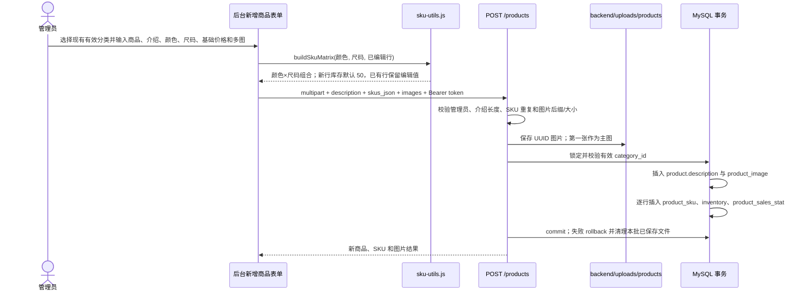
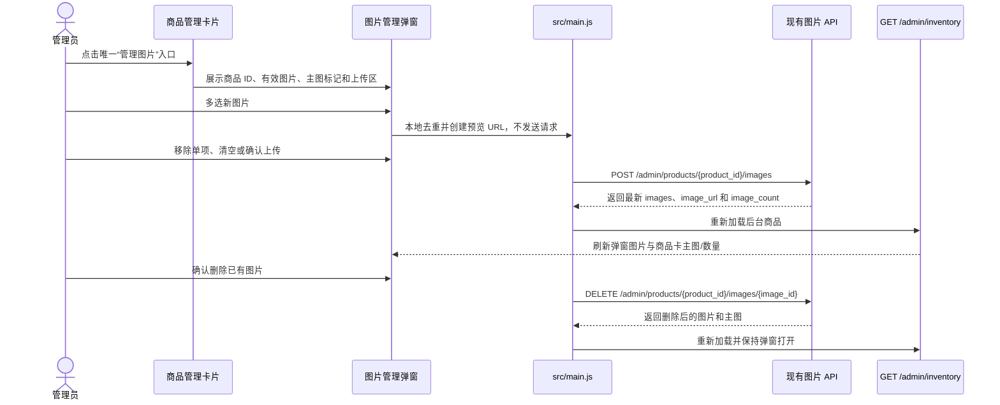
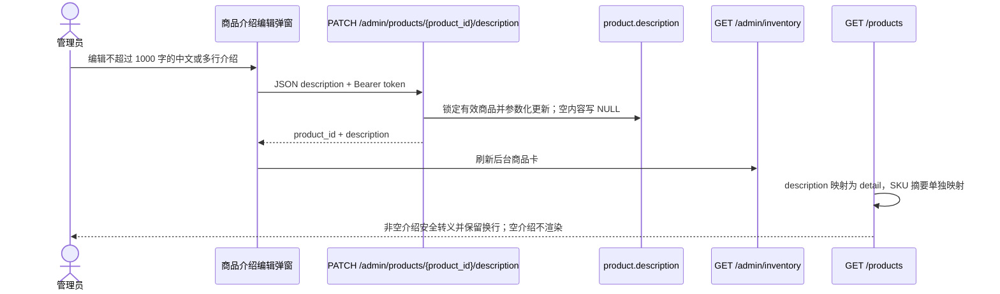

# Cloth-Shop 当前项目架构

- 文档生成日期：2026-07-15
- 当前分支：`master`
- 当前 commit：`4ebf2fde4f9bc46a2cefbab87facb3c3ca8f3bf3`（本轮开始时审计基线；本文包含当前工作区待提交的最终演示数据清理变更）
- 项目技术栈：原生 HTML/CSS/JavaScript ES Module + FastAPI + PyMySQL + MySQL 8.0.28
- 数据库名称：`frieren_cloth_shop_db`
- 后端端口：`8050`
- 前端端口：`5900`
- 当前自动测试结果：`npm.cmd test` 223/223 通过；`tests.reset_final_demo_data_unit` 6/6 通过
- 文档基线：审计起始 commit 为 `73bd07effa932cc467d39b73c224ba3c1119d5e4`（`feat: 集成标签操作日志与并行分支`）；阶段 17 最终提交 SHA 以 Git 历史为准

> 本文档描述当前代码快照。自动测试以纯函数行为和源码结构契约为主；既有退款轮次已完成专用订单验证。阶段 4—13 的既有验收保持不变；阶段 14—15 提供商品多标签和 1～100 商品批量 ADD/REMOVE/REPLACE/CLEAR，阶段 16 为管理员写操作增加同事务成功审计和回滚后失败审计，并提供受保护的日志查询 API 与只读后台面板。阶段 14—16 已在本次集成中完成联合 SQL、API、浏览器和精确数据恢复验证；未执行项会明确标注。

## 1. 项目概述

Cloth-Shop 是一个服装商城与进销存管理课程设计。前台承担商品浏览、分类/标签筛选、SKU 选择、收藏、购物车、地址、下单、支付和订单记录；后台承担管理员认证、分类、标签、商品/SKU/图片/库存、订单发货、退款审核、销量统计和只读操作审计。FastAPI 提供 HTTP 接口、鉴权、文件上传与事务编排，PyMySQL 连接 MySQL；MySQL 保存分类、标签、商品、库存、订单、支付、日志和销量，并通过视图、存储过程、触发器维护主要业务一致性。

## 2. 核心技术栈

| 层级 | 技术 | 主要职责 |
|---|---|---|
| 页面结构 | HTML | 定义前台、后台、弹窗、侧栏、表单和 `data-*` 交互入口 |
| 视觉层 | CSS | 统一前后台布局、响应式样式、状态和弹窗表现 |
| 浏览器逻辑 | JavaScript ES Module | 页面状态、事件绑定、API 调用、SKU 组合与本地兼容状态 |
| Web API | FastAPI | 路由、参数校验、管理员鉴权、文件上传、错误响应和事务编排 |
| 数据访问 | PyMySQL | 参数化 SQL、视图/存储过程调用、显式提交与回滚 |
| 数据库 | MySQL 8.0.28 | 业务数据、外键/检查约束、视图、存储过程、触发器和函数 |
| 自动测试 | Node.js `node:test` | 纯函数行为测试、HTML/CSS/JS/Python/SQL 源码契约断言 |
| 本地启动 | PowerShell + Batch | 同时启动 Uvicorn `8050` 与静态服务器 `5900`，等待端口就绪 |

## 3. 项目目录结构

```text
Cloth-Shop/
├─ index.html                         # 前台页面、购买弹窗、图片大图和个人中心侧栏
├─ admin.html                         # 后台登录、订单、商品、SKU、图片、统计和只读操作日志面板
├─ src/
│  ├─ main.js                         # 前后台共享入口；DOM、状态、API 与图片待上传预览等主要业务交互
│  ├─ category-utils.js               # API/静态分类规范化、排序、稳定键与商品分类筛选纯函数
│  ├─ tag-utils.js                    # 标签规范化/筛选与后台批量商品选择纯函数
│  ├─ image-lightbox.js               # 前台大图列表规范化、索引解析、循环切换与初始状态纯函数
│  ├─ styles.css                      # 前后台共用样式和响应式规则
│  ├─ content.js                      # 静态文案、分类、17 个展示商品和旧 mock 种子
│  ├─ account-store.js                # localStorage 兼容数据、纯函数和旧后台 mock 辅助
│  ├─ account-state.js                # 未接入当前入口的旧账号/地址状态辅助
│  ├─ ranking.js                      # 销量解析、排序和排名格式化
│  ├─ product-ordering.js             # 商品可售判断和前台排序规则
│  └─ sku-utils.js                    # 颜色×尺码矩阵、SKU 选择和缺失组合生成
├─ backend/
│  ├─ app/
│  │  ├─ main.py                      # FastAPI 应用、全部路由、鉴权、上传、SQL 和事务
│  │  ├─ operation_logs.py            # 日志白名单清理、request_id、参数化写入与失败短事务
│  │  └─ db.py                        # `.env` 加载、PyMySQL 连接和连接上下文
│  ├─ requirements.txt                # Python 依赖清单
│  └─ uploads/products/               # 运行时商品图片目录；文档不枚举具体文件
├─ scripts/
│  └─ reset_final_demo_data.py         # 带预览、备份、事务、计数、图片失败清单与幂等验证的最终数据清理工具
├─ sql语句/
│  ├─ 01_数据库结构与增量迁移.sql     # 数据库、16 张表和复杂 SKU 增量字段
│  ├─ 02_视图.sql                     # 6 个业务视图及复杂 SKU 商品视图覆盖
│  ├─ 03_存储过程_触发器_函数.sql     # 11 个过程、3 个触发器和 1 个函数
│  ├─ 04_测试数据与验证.sql           # 测试数据、业务流程演示和一致性查询
│  ├─ 05_账号与支付密码初始化.sql     # 支付密码字段/测试用户与管理员初始化
│  ├─ 06_商品描述增量迁移.sql         # product.description 与商品详情视图增量
│  ├─ 07_订单买家备注增量迁移.sql     # order_main.buyer_remark、订单视图与立即购买兼容过程
│  ├─ 08_购物车选中项备注下单增量迁移.sql # 购物车选中项备注下单兼容过程
│  ├─ 09_商品多标签增量迁移.sql       # tag 与 product_tag 多标签关系表、索引和外键
│  └─ 10_管理员操作日志增量迁移.sql   # operation_log 字段与三组查询索引的幂等增量
├─ tests/site.test.js                 # Node.js 行为、Python 事务替身与源码结构测试入口
├─ tests/product_tags_batch_unit.py   # 批量标签权限、提交、回滚、响应与原子错误行为测试
├─ tests/reset_final_demo_data_unit.py # 删除顺序、事务/备份失败和商品图片重试边界单元测试
├─ start_dev.ps1                      # 双服务启动、端口等待和浏览器打开逻辑
├─ start_dev.bat                      # Windows 一键启动入口
├─ package.json                       # `node --test tests/site.test.js`
├─ README.md                          # 项目、初始化、启动和常见问题说明
└─ AGENTS.md                          # 仓库修改、数据库、测试和 Git 约束
```

## 4. 系统分层架构



前端通过 `python -m http.server 5900` 提供静态页面；FastAPI 在 `8050` 提供 API，并把 `backend/uploads` 挂载为 `/uploads`。数据库连接使用 `DictCursor`、`utf8mb4`、`autocommit=False`。

## 5. 前台模块

| 模块 | 页面入口 | JavaScript 核心函数/模块 | API | 数据库对象 |
|---|---|---|---|---|
| 商品加载 | `index.html` 的 `data-product-grid` | `loadProductsFromApi()`、`convertApiProducts()`；真实介绍安全转义并保留换行，响应中的 `tags` 规范化到商品 | `GET /products` | `v_product_detail`、`product_image`、`product_tag`、`tag` |
| 分类导航 | `data-collection` 分类按钮 | `loadStorefrontCategories()`、`renderStorefrontCategories()` 与 `category-utils.js`；API 失败时按商品/静态分类兜底，稳定键为 `category:{id}` | `GET /categories` | `category`、`product` |
| 标签导航 | `data-product-tag-rail` 标签按钮 | `loadStorefrontTags()`、`renderStorefrontTags()` 与 `tag-utils.js`；API 失败时按商品/静态促销徽章兜底，稳定键为 `tag:{id}` | `GET /tags` | `tag`、`product_tag`、`product` |
| 商品搜索 | `data-product-search` | `getProductSearchText()`、`filteredProducts()`；商品名、分类、介绍、SKU 和标签名共同参与，并与分类/标签同时生效 | 无；浏览器内过滤 | API 商品内存集合 |
| 商品排序 | 商品网格 | `compareProductsForCustomer()`、`getSalesRankMap()` | 无；浏览器内排序 | `product_sales_stat` 的 API 映射 |
| 商品可售状态与印章 | 商品卡、收藏卡、`data-purchase-image-frame` | `resolveProductAvailabilityState()`、`getProductDisplayState()`、`renderProductStateStamp()`；首页、收藏夹和详情复用同一商品级状态 | 无新增接口；复用 `GET /products` | `product.status`、`product_sku.status/is_deleted`、`inventory.available_stock` 的 API 映射 |
| 统一商品大图预览 | 商品详情/收藏详情共用弹窗的主图、当前缩略图与 `data-image-lightbox` | `image-lightbox.js` 的 `normalizeLightboxImages()`、`resolveLightboxIndex()`、`wrapLightboxIndex()`、`createImageLightboxState()`；`main.js` 的 `openImageLightbox()`、`renderImageLightbox()`、`showImageLightboxStep()` | 图片随 `GET /products` 返回；无新增请求 | `product_image`、兼容字段 `product.image_url` |
| SKU 选择 | 商品卡 `data-product-sku-id`、共用弹窗 `data-purchase-sku-options` | `getSellableProductSkus()`、`resolveInitialSkuSelection()`、`selectSkuDimension()`、`setPurchaseSku()`、`setPurchaseDimension()`；商品级缓存为 `selectedSkuByProductId` | SKU 随 `GET /products` 返回 | `product_sku`、`inventory` |
| 收藏 | 商品卡、个人中心收藏卡片、共用只读详情弹窗 | `upsertFavorite()`、`renderFavoriteProductItems()`、`renderFavoritesShelf()`、`openPurchaseModal(product, "details")`；新快照保存标签，实时商品标签保持权威 | 当前未实现收藏 API；详情只复用已加载商品数据，不发新请求 | `localStorage: blue-song-favorites` |
| 加入购物车 | 共用购买弹窗 | `addCartToApi()`、`syncCartFromApi()` | `POST /cart/add`、`GET /cart/{user_id}` | `cart`、`cart_item`、`product_sku`、`inventory` |
| 购物车结算 | 个人中心购物车 | `cartCheckoutState`、`submitCartCheckout()`、`submitCreatedCartOrderPayment()`；勾选、地址、备注、下单、支付和稍后支付分步处理 | `POST /orders/from-cart-selected` 后按需调用 `POST /orders/pay` | `cart_item`、`order_main.buyer_remark`、`order_item`、`inventory`、`inventory_log`、`payment_record` |
| 直接购买 | 共用购买弹窗；仅立即购买显示备注输入 | `createDirectOrderFromApi()`、`submitPurchaseOrder()`；备注在 SKU/数量/图片切换时保留，关闭或创建成功后清空 | `POST /orders/direct` 的可选 `buyer_remark` | `order_main.buyer_remark`、`order_item`、`inventory`、`inventory_log` |
| 地址管理 | 个人中心地址面板 | `loadAddressesFromApi()`、`addAddressToApi()`、`setDefaultAddressToApi()`、`deleteAddressFromApi()` | `GET /addresses/user/{user_id}`、`POST /addresses/add`、`/set-default`、`/delete` | `user_address` |
| 订单记录 | 个人中心订单面板 | `loadOrdersFromApi()`、`renderApiOrders()`、`showOrderDetail()`；详情显示买家备注或“无” | `GET /orders/user/{user_id}`、`GET /orders/{order_id}` | `v_order_summary`、`v_user_order_detail`、支付/状态/库存日志 |
| 支付 | 购买弹窗和待支付订单 | `payOrderFromApi()`、`payOrderWithPasswordPrompt()` | `POST /orders/pay` | `user.pay_password_hash`、`order_main`、`payment_record`、`inventory`、`product_sales_stat` |
| 取消订单 | 待支付订单操作 | `cancelOrderFromApi()`、`handleCancelOrder()` | `POST /orders/cancel` | `order_main`、`order_status_log`、`inventory`、`inventory_log` |
| 退款申请 | 已支付/已发货订单操作 | `refundOrderFromApi()`、`handleRefundOrder()` | `POST /orders/refund` | `order_main`、`order_status_log`；订单级请求只发送 `user_id`、`order_id`、`remark` |

重要页面契约包括 `data-product-id`、`data-product-tag-rail`、`data-product-tag`、`data-product-state`、`data-product-state-stamp`、`data-product-sku-id`、`data-purchase-image-frame`、`data-purchase-tags`、`data-purchase-color`、`data-purchase-size`、`data-purchase-remark-section`、`data-purchase-buyer-remark`、`data-purchase-buyer-remark-count`、`data-purchase-payment-title`、`data-purchase-address-id`、`data-cart-select-id`、`data-cart-checkout`、`data-order-detail-id`、`data-order-pay-id`、`data-order-cancel-id` 和 `data-order-refund-id`。修改标记名必须同步检查 `index.html`、`src/main.js` 与 `tests/site.test.js`。

## 6. 后台模块

| 模块 | 页面入口 | JavaScript 核心函数/模块 | API | 数据库对象 |
|---|---|---|---|---|
| 管理员登录 | `data-admin-login-form` | `loginAdmin()`、`renderAdminAuthState()` | `POST /admin/login` | `user` |
| 登录状态恢复 | 页面初始化 | `getStoredAdminSession()`、`requireAdminSessionBeforeLoading()`、`adminFetch()` | 通过首批受保护 API 验证，无独立 `/admin/me` | `sessionStorage` + `user` |
| 商品搜索和筛选 | 商品管理面板 | `getFilteredAdminProductRows()`、后台 `renderProducts()` | 无新增请求；内存过滤 | `GET /admin/inventory` 已加载结果 |
| 分类管理 | `data-admin-panel="categories"` | `loadAdminCategoriesFromApi()`、`renderAdminCategories()`、新增/保存/删除/恢复处理；按全部/使用中/已删除筛选 | `GET/POST/PATCH/DELETE /admin/categories...` | `category`、`product` |
| 调整商品分类 | 商品管理卡片分类选择器 | `updateAdminProductCategoryToApi()` | `PATCH /admin/products/{product_id}/category` | `product.category_id`、`category` |
| 标签管理 | `data-admin-panel="tags"` | `loadAdminTagsFromApi()`、`renderAdminTags()`、新增/保存/删除/恢复处理；按全部/使用中/已删除筛选 | `GET/POST/PATCH/DELETE /admin/tags...` | `tag`、`product_tag`、`product` |
| 调整商品标签 | 商品管理卡片标签复选集合 | `updateAdminProductTagsToApi()`；完整替换、去重且最多 5 个 | `PATCH /admin/products/{product_id}/tags` | `product_tag`、`tag`、`product` |
| 批量调整商品标签 | `data-admin-product-batch-toolbar` 与商品卡批量复选框 | `adminProductTagBatchState`、`tag-utils.js` 选择纯函数、`updateAdminProductTagsBatchToApi()`；当前筛选列表最多选择 100 个商品 | `PATCH /admin/products/tags/batch` | `product`、`tag`、`product_tag` |
| 新增商品 | `data-admin-product-form` | `buildSkuMatrix()`、`createAdminProductToApi()`；选择现有有效 `category_id` 和最多 5 个 `tag_ids_json`，提交最多 1000 字普通文本介绍，新生成 SKU 默认库存 50 | `POST /products` | `category`、`tag`、`product_tag`、`product.description`、`product_sku`、`inventory`、`product_sales_stat`、`product_image` |
| 编辑或清空商品介绍 | 商品卡“编辑介绍”与 `data-admin-description-editor` | `updateAdminProductDescriptionToApi()`、`refreshAdminProductsFromApi()` | `PATCH /admin/products/{product_id}/description` | `product.description` |
| SKU 管理 | `data-admin-sku-manager` | `loadAdminProductSkusToApi()`、`createAdminProductSkusToApi()`、`updateAdminProductSkuToApi()`、`deleteAdminProductSkuToApi()` | `GET/POST /admin/products/{product_id}/skus`、`PATCH/DELETE /admin/products/{product_id}/skus/{sku_id}` | `product_sku`、`inventory`、`product_sales_stat` |
| 库存更新 | 商品卡和 SKU 管理器 | `updateAdminSkuStockToApi()` | `POST /admin/inventory/update-stock` | `inventory` |
| 商品上下架 | 商品管理面板 | `updateAdminProductStatusToApi()` | `POST /admin/products/update-status` | `product`、`product_sku` |
| 商品逻辑删除 | 商品管理面板 | `deleteAdminProductToApi()` | `POST /admin/products/delete` | `product.is_deleted`、`product_sku.is_deleted` |
| 图片查看、追加和删除 | 商品卡唯一的 `data-admin-product-image-manage` 入口与 `data-admin-image-manager` 弹窗 | `renderAdminProductImageManager()`、`submitAdminImageManagerUpload()`、`appendAdminProductImagesToApi()`、`deleteAdminProductImageToApi()` | `POST/DELETE /admin/products/{product_id}/images...` | `product_image`、兼容主图 `product.image_url` |
| 后台订单 | 订单面板 | `loadAdminOrdersFromApi()`、`renderAdminOrderDetail()`；与用户端共用详情渲染并显示买家备注 | `GET /admin/orders`、`GET /admin/orders/{order_id}` | `v_order_summary`、`v_user_order_detail`、支付/状态/库存日志 |
| 发货和取消发货 | 订单操作列 | `shipAdminOrderToApi()`、`unshipAdminOrderToApi()` | `POST /admin/orders/ship`、`/unship` | `order_main`、`order_status_log` |
| 退款同意和拒绝 | 退款待处理订单 | `approveAdminRefundToApi()`、`rejectAdminRefundToApi()` | `POST /admin/orders/refund/approve`、`/reject` | `order_main`、`inventory`、`inventory_log`、`payment_record`、`product_sales_stat` |
| 销量统计 | 销量统计面板 | `refreshAdminStatsFromApi()`、`convertApiStatsToRenderedStats()` | `GET /admin/stats` | `order_main`、`order_item`、`product`、`v_product_sales_rank` |
| 管理员操作日志 | `data-admin-panel="operation-logs"` 只读面板 | `loadAdminOperationLogOptions()`、`loadAdminOperationLogs()`、`renderAdminOperationLogs()`；筛选、展开详情与分页 | `GET /admin/operation-logs`、`GET /admin/operation-log-options` | `operation_log`、`user` |

后台导航当前有订单查看、商品管理、分类管理、标签管理、新增商品、销量统计、操作日志七项。商品接口成功返回空数组时展示“暂无商品数据”，失败且不是 401/403 时展示明确加载失败，不再读取 `localStorage` mock 商品。操作日志面板错误只更新本面板反馈；401/403 继续复用统一登录失效清理。

## 7. 后端 API 结构

### 商品与 SKU

| 方法 | 路径 | 作用 | 权限 | 主要数据库对象 |
|---|---|---|---|---|
| GET | `/products` | 查询商品介绍、结构化 SKU、库存、销量、图片和有效标签数组 | 公开 | `v_product_detail`、`product_image`、`product_tag`、`tag` |
| POST | `/products` | multipart 新增商品；校验有效 `category_id` 与可选 `tag_ids_json`（去重、最多 5 个），在同一事务写商品、SKU、库存、图片和标签关联 | 管理员 Bearer 令牌 | `category`、`tag`、`product_tag`、`product`、`product_sku`、`inventory`、`product_sales_stat`、`product_image` |
| PATCH | `/admin/products/{product_id}/category` | 锁定有效商品和分类后只更新 `product.category_id`；同分类重复提交幂等 | 管理员 Bearer 令牌 | `product`、`category` |
| PATCH | `/admin/products/{product_id}/description` | 修改或清空最多 1000 字的商品介绍 | 管理员 Bearer 令牌 | `product.description` |
| GET | `/admin/products/{product_id}/skus` | 查询商品全部 SKU（含逻辑删除项） | 管理员 Bearer 令牌 | `product_sku`、`inventory` |
| POST | `/admin/products/{product_id}/skus` | 批量新增缺失 SKU 组合 | 管理员 Bearer 令牌 | `product_sku`、`inventory`、`product_sales_stat` |
| PATCH | `/admin/products/{product_id}/skus/{sku_id}` | 修改维度、价格、库存和在售状态 | 管理员 Bearer 令牌 | `product_sku`、`inventory` |
| DELETE | `/admin/products/{product_id}/skus/{sku_id}` | 逻辑删除 SKU，禁止删除最后一个有效 SKU | 管理员 Bearer 令牌 | `product_sku` |

### 商品分类

| 方法 | 路径 | 作用 | 权限 | 主要数据库对象 |
|---|---|---|---|---|
| GET | `/categories` | 查询有效分类、排序值和商品统计，包含暂时没有商品的分类 | 公开 | `category`、`product` |
| GET | `/admin/categories` | 查询全部分类（含逻辑删除）和有效/删除商品统计 | 管理员 Bearer 令牌 | `category`、`product` |
| POST | `/admin/categories` | 新增分类；同名已删除分类恢复原 ID | 管理员 Bearer 令牌 | `category` |
| PATCH | `/admin/categories/{category_id}` | 修改分类名称和排序值，名称唯一 | 管理员 Bearer 令牌 | `category` |
| DELETE | `/admin/categories/{category_id}` | 空分类逻辑删除；有任意商品引用时拒绝；重复删除幂等 | 管理员 Bearer 令牌 | `category`、`product` |
| POST | `/admin/categories/{category_id}/restore` | 恢复已删除分类，重复恢复幂等 | 管理员 Bearer 令牌 | `category` |

### 商品标签

| 方法 | 路径 | 作用 | 权限 | 主要数据库对象 |
|---|---|---|---|---|
| GET | `/tags` | 查询有效标签、排序值和关联有效商品数，包含暂时没有商品的标签 | 公开 | `tag`、`product_tag`、`product` |
| GET | `/admin/tags` | 查询全部标签（含逻辑删除）和关联有效商品数 | 管理员 Bearer 令牌 | `tag`、`product_tag`、`product` |
| POST | `/admin/tags` | 新增标签；同名已删除标签恢复原 ID | 管理员 Bearer 令牌 | `tag` |
| PATCH | `/admin/tags/{tag_id}` | 修改标签名称和排序值，名称唯一 | 管理员 Bearer 令牌 | `tag` |
| DELETE | `/admin/tags/{tag_id}` | 空标签逻辑删除；仍关联有效商品时返回 409 与 `product_count`；重复删除幂等 | 管理员 Bearer 令牌 | `tag`、`product_tag`、`product` |
| POST | `/admin/tags/{tag_id}/restore` | 恢复已删除标签，重复恢复幂等 | 管理员 Bearer 令牌 | `tag` |
| PATCH | `/admin/products/{product_id}/tags` | 锁定有效商品和标签后完整替换标签集合；去重、最多 5 个，同集合重复提交幂等 | 管理员 Bearer 令牌 | `product`、`tag`、`product_tag` |
| PATCH | `/admin/products/tags/batch` | 对 1～100 个商品原子执行 `ADD` / `REMOVE` / `REPLACE` / `CLEAR`；返回逐商品前后标签及 changed/unchanged 统计 | 管理员 Bearer 令牌 | `product`、`tag`、`product_tag` |

### 图片

| 方法 | 路径 | 作用 | 权限 | 主要数据库对象 |
|---|---|---|---|---|
| POST | `/admin/products/{product_id}/images` | 向已有商品追加多张图片 | 管理员 Bearer 令牌 | `product`、`product_image` |
| DELETE | `/admin/products/{product_id}/images/{image_id}` | 逻辑删除图片；删除主图时提升下一张 | 管理员 Bearer 令牌 | `product`、`product_image` |

当前没有独立图片查询 API；图片数组附加在商品/后台库存响应中。后台商品卡只保留“管理图片”入口，弹窗统一查看已有图片、选择与预览待上传图片、确认上传和删除；上传、删除成功后均重新加载 `GET /admin/inventory`，同步刷新弹窗和商品卡。当前仍没有手动指定任意图片为主图的 API。

### 购物车

| 方法 | 路径 | 作用 | 权限 | 主要数据库对象 |
|---|---|---|---|---|
| GET | `/cart/{user_id}` | 查询用户购物车与实时 SKU/库存状态 | 未做用户令牌校验 | `cart`、`cart_item`、`product_sku`、`product`、`inventory` |
| POST | `/cart/add` | 添加 SKU；同 SKU 累加数量 | 未做用户令牌校验 | `sp_add_to_cart`、`cart`、`cart_item` |
| POST | `/cart/update-quantity` | 修改购物车项数量并校验归属/库存 | 未做用户令牌校验 | `sp_update_cart_item_quantity`、`cart_item`、`inventory` |
| POST | `/cart/delete-item` | 删除指定购物车项 | 未做用户令牌校验 | `sp_delete_cart_item`、`cart_item` |

### 地址

| 方法 | 路径 | 作用 | 权限 | 主要数据库对象 |
|---|---|---|---|---|
| GET | `/addresses/user/{user_id}` | 查询未删除地址 | 未做用户令牌校验 | `user_address` |
| POST | `/addresses/add` | 新增地址，可设为默认 | 未做用户令牌校验 | `user_address` |
| POST | `/addresses/set-default` | 切换默认地址 | 未做用户令牌校验 | `sp_set_default_address`、`user_address` |
| POST | `/addresses/delete` | 逻辑删除地址 | 未做用户令牌校验 | `sp_delete_user_address`、`user_address` |

### 订单与支付

| 方法 | 路径 | 作用 | 权限 | 主要数据库对象 |
|---|---|---|---|---|
| POST | `/orders/from-cart` | 整个购物车创建待支付订单 | 未做用户令牌校验 | `sp_create_order_from_cart`、订单/购物车/库存表 |
| POST | `/orders/from-cart-selected` | 仅用选中购物车项创建待支付订单；`buyer_remark` 可空、去首尾空白、纯空白转 `NULL`、最多 500 字 | 未做用户令牌校验 | `sp_create_order_from_selected_cart_items_with_remark`、订单/购物车/库存表；旧过程继续保留 |
| POST | `/orders/direct` | 校验 SKU 与可选 `buyer_remark`（去首尾空白、空值转 `NULL`、最多 500 字）后创建待支付订单 | 未做用户令牌校验 | `sp_create_direct_order_with_remark`、`order_main`、`order_item`、`inventory` |
| POST | `/orders/pay` | 校验订单归属和 6 位支付密码后支付 | 未做用户令牌校验 | `user`、`sp_pay_order`、`payment_record`、`inventory`、`product_sales_stat` |
| POST | `/orders/cancel` | 取消待支付订单并释放锁定库存 | 未做用户令牌校验 | `sp_cancel_order`、`order_main`、`inventory`、日志表 |
| GET | `/orders/user/{user_id}` | 查询用户订单列表并透传 `buyer_remark` | 未做用户令牌校验 | `v_order_summary` |
| GET | `/orders/{order_id}` | 查询订单、买家备注、支付、状态和库存流水 | 未做用户令牌校验 | `v_order_summary`、`v_user_order_detail`、日志表 |

### 退款

| 方法 | 路径 | 作用 | 权限 | 主要数据库对象 |
|---|---|---|---|---|
| POST | `/orders/refund` | 锁定归属订单，将已支付/已发货订单改为退款待处理 | 未做用户令牌校验；按请求体 `user_id` 校验订单归属 | `order_main`、`order_status_log` |
| POST | `/admin/orders/refund/approve` | 恢复库存、记录退款、回滚销量并完成退款 | 管理员 Bearer 令牌 | `order_main`、`inventory`、`inventory_log`、`payment_record`、`product_sales_stat` |
| POST | `/admin/orders/refund/reject` | 恢复退款申请前的 `PAID` 或 `SHIPPED` | 管理员 Bearer 令牌 | `order_main`、`order_status_log` |

### 管理员认证

| 方法 | 路径 | 作用 | 权限 | 主要数据库对象 |
|---|---|---|---|---|
| POST | `/admin/login` | 校验管理员邮箱、密码、管理员标记并签发 8 小时令牌；成功后独立尽力写 `ADMIN_LOGIN` | 公开登录入口 | `user`、`operation_log` |

当前未实现 `/admin/me`、服务器端 token 存储、撤销列表或登出 API。

### 后台商品

| 方法 | 路径 | 作用 | 权限 | 主要数据库对象 |
|---|---|---|---|---|
| GET | `/admin/inventory` | 查询未删除商品的介绍、全部 SKU、库存、销量和图片 | 管理员 Bearer 令牌 | `v_product_detail`、`product_image` |
| POST | `/admin/inventory/update-stock` | 锁定库存行后修改 `available_stock` | 管理员 Bearer 令牌 | `product_sku`、`inventory` |
| POST | `/admin/products/update-status` | 同步上下架商品和全部有效 SKU | 管理员 Bearer 令牌 | `product`、`product_sku` |
| POST | `/admin/products/delete` | 逻辑删除商品和全部有效 SKU | 管理员 Bearer 令牌 | `product`、`product_sku` |

### 后台订单

| 方法 | 路径 | 作用 | 权限 | 主要数据库对象 |
|---|---|---|---|---|
| GET | `/admin/orders` | 查询全部订单并透传 `buyer_remark` | 管理员 Bearer 令牌 | `v_order_summary` |
| GET | `/admin/orders/{order_id}` | 查询含买家备注的订单完整详情 | 管理员 Bearer 令牌 | `v_order_summary`、`v_user_order_detail`、支付/状态/库存日志 |
| POST | `/admin/orders/ship` | `PAID → SHIPPED` | 管理员 Bearer 令牌 | `order_main`、`order_status_log` |
| POST | `/admin/orders/unship` | `SHIPPED → PAID` | 管理员 Bearer 令牌 | `order_main`、`order_status_log` |

### 统计

| 方法 | 路径 | 作用 | 权限 | 主要数据库对象 |
|---|---|---|---|---|
| GET | `/admin/stats` | 汇总订单、销售额、件数、商品数和 SKU 销量排行 | 管理员 Bearer 令牌 | `order_main`、`order_item`、`product`、`v_product_sales_rank` |

### 管理员操作日志

| 方法 | 路径 | 作用 | 权限 | 主要数据库对象 |
|---|---|---|---|---|
| GET | `/admin/operation-logs` | 按动作、目标、结果、操作者、关键词和时间筛选，固定按时间/ID 倒序分页并解析结构化详情 | 管理员 Bearer 令牌 | `operation_log`、`user` |
| GET | `/admin/operation-log-options` | 返回数据库已出现的动作/目标、操作者和固定结果选项 | 管理员 Bearer 令牌 | `operation_log`、`user` |

## 8. 数据库结构

### 8.1 核心表

| 表 | 作用 | 关键关系 |
|---|---|---|
| `user` | 普通用户、管理员和密码/支付密码载体 | 被地址、购物车、订单、操作日志引用；`email` 唯一 |
| `user_address` | 用户收货地址、默认地址和逻辑删除 | `user_id → user.id`；被订单引用 |
| `category` | 商品分类与排序 | 被 `product.category_id` 引用；`name` 唯一 |
| `tag` | 商品标签、排序和逻辑删除 | `name` 唯一；被 `product_tag.tag_id` 引用 |
| `product` | 商品主数据、可空普通文本介绍、状态和兼容主图 | 属于分类；被标签关联、SKU、图片引用 |
| `product_tag` | 商品与标签的多对多关联 | `(product_id, tag_id)` 联合主键；外键不使用物理级联删除；反向标签索引支持统计 |
| `product_image` | 商品多图、主图、排序和逻辑删除 | `product_id → product.id` |
| `product_sku` | SKU 编码、名称、颜色、尺码、价格、状态 | `product_id → product.id`；被库存、购物车、订单、销量引用 |
| `inventory` | 每个 SKU 的可用库存和锁定库存 | `sku_id → product_sku.id` 且唯一 |
| `cart` | 用户活动购物车 | `user_id → user.id` 且唯一 |
| `cart_item` | 购物车 SKU 与数量 | 引用 `cart`、`product_sku`；`(cart_id, sku_id)` 唯一 |
| `order_main` | 订单号、用户、地址、状态、总金额和可空的 500 字买家备注 | 引用 `user`、`user_address`；`order_no` 唯一；备注不建索引 |
| `order_item` | 下单时的 SKU、数量和成交价快照 | 引用 `order_main`、`product_sku` |
| `payment_record` | 支付和退款记录 | `order_id → order_main.id` |
| `order_status_log` | 订单状态迁移日志 | `order_id → order_main.id` |
| `inventory_log` | SKU 库存变化流水 | `sku_id → product_sku.id`，`ref_no` 关联业务单号 |
| `operation_log` | 管理员运行时审计；动作、目标、结果、安全详情、request_id 和时间 | `operator_id → user.id`；成功审计与业务写入同事务，失败审计在回滚后独立尽力写入 |
| `product_sales_stat` | SKU 累计销量和销售额 | `sku_id` 同时是主键和外键，一 SKU 一行 |

主要唯一约束还包括 `cart.user_id`、`inventory.sku_id`、`cart_item(cart_id, sku_id)`；复杂 SKU 增量增加 `sku_code` 与 `(product_id, color_name, size_name, is_deleted)` 查询索引，但 SQL 未声明 `sku_code` 或颜色尺码组合的数据库唯一约束，唯一性主要由后端事务内查询校验。

### 8.2 实体关系图



### 8.3 视图、存储过程与触发器

#### 视图

| 名称 | 用途 | 关联业务 |
|---|---|---|
| `v_product_detail` | 商品介绍、SKU、库存、销量的联合明细；最终版本包含颜色、尺码和库存更新时间 | 前台商品、后台库存 |
| `v_user_cart_detail` | 用户购物车、商品、SKU、金额与库存 | 购物车展示 |
| `v_user_order_detail` | 订单、买家备注、地址、明细、商品、SKU 和支付联合详情 | 前后台订单详情 |
| `v_inventory_status` | 可用/锁定/总库存和库存状态 | 后台库存、库存预警 |
| `v_product_sales_rank` | 按 SKU 销量和销售额计算排名 | 首页排名、后台统计 |
| `v_order_summary` | 订单买家备注、品类数、件数和金额汇总 | 前后台订单列表、统计 |

#### 存储过程

| 名称 | 用途 | 关联业务 |
|---|---|---|
| `sp_add_to_cart` | 创建购物车或累加同 SKU 数量 | 加入购物车 |
| `sp_create_order_from_cart` | 整车下单、锁定库存、生成明细、清空购物车 | 购物车结算 |
| `sp_create_order_from_selected_cart_items` | 只结算选中购物车项 | 保留给旧调用方兼容，当前前台不再调用 |
| `sp_create_order_from_selected_cart_items_with_remark` | 去重选中项、校验归属/状态/库存，在同一事务写备注、订单明细、库存锁定/日志并只删除选中购物车项 | 当前前台购物车结算；旧过程兼容保留 |
| `sp_create_direct_order` | 不经过购物车直接创建待支付订单 | 立即购买 |
| `sp_create_direct_order_with_remark` | 在同一事务写入可空买家备注并创建待支付订单；保留旧过程兼容其他调用方 | 当前立即购买 API |
| `sp_pay_order` | 支付订单、消耗锁定库存、写支付记录 | 支付、销量 |
| `sp_cancel_order` | 取消待支付订单并释放锁定库存 | 取消订单 |
| `sp_update_cart_item_quantity` | 校验用户、库存后修改数量 | 购物车改量 |
| `sp_delete_cart_item` | 删除用户购物车项 | 购物车删除 |
| `sp_set_default_address` | 清除旧默认并设置新默认地址 | 地址管理 |
| `sp_delete_user_address` | 逻辑删除地址 | 地址管理 |
| `sp_refund_paid_order` | 旧的已支付订单退款过程 | 当前 FastAPI 未调用；退款审核由 Python 事务实现 |

#### 触发器与函数

| 名称 | 类型 | 用途 |
|---|---|---|
| `trg_order_main_after_insert` | 触发器 | 新订单插入后写入初始状态日志 |
| `trg_order_main_after_update` | 触发器 | 状态变化后写日志；状态转为 `PAID` 时维护销量 |
| `trg_inventory_before_update` | 触发器 | 阻止可用库存或锁定库存更新为负数 |
| `fn_get_stock_status` | 函数 | 将可用库存转换为缺货、低库存或正常状态 |

### 8.4 SQL 初始化顺序

1. `sql语句/01_数据库结构与增量迁移.sql`：创建数据库、15 张基础表、`product_image` 扩展表，并增加复杂 SKU 字段与索引。
2. `sql语句/02_视图.sql`：创建 6 个业务视图，最后用复杂 SKU 版本覆盖 `v_product_detail`。
3. `sql语句/03_存储过程_触发器_函数.sql`：创建购物车、订单、支付、取消、地址和退款过程，以及状态/库存触发器和库存状态函数。
4. `sql语句/04_测试数据与验证.sql`：清理并写入固定测试数据，执行下单/支付/取消演示和一致性查询；只应在测试数据库使用。
5. `sql语句/05_账号与支付密码初始化.sql`：补充支付密码哈希字段，初始化测试用户支付密码与管理员账号。
6. `sql语句/06_商品描述增量迁移.sql`：幂等增加 `product.description`，并覆盖 `v_product_detail` 以透传商品介绍。
7. `sql语句/07_订单买家备注增量迁移.sql`：幂等增加 `order_main.buyer_remark`，覆盖订单列表/详情视图，并创建兼容的 `sp_create_direct_order_with_remark`。
8. `sql语句/08_购物车选中项备注下单增量迁移.sql`：不改字段和视图，幂等创建 `sp_create_order_from_selected_cart_items_with_remark`，旧选中项过程继续存在。
9. `sql语句/09_商品多标签增量迁移.sql`：幂等创建逻辑删除的 `tag` 表与 `product_tag` 关联表、唯一/查询索引和两个无物理级联的外键；不写入或改动现有业务数据。
10. `sql语句/10_管理员操作日志增量迁移.sql`：幂等增加 `target_type`、`target_id`、`action_result`、`detail_json`、`request_id` 与动作/目标/结果时间索引；保留旧字段、旧索引和旧日志。

从零初始化时必须按以上顺序执行，顺序固定为 `08 → 09 → 10`。已存在数据库只需按编号执行尚未应用的增量；`04` 当前是固定规模演示数据（16 商品、32 SKU、8 订单等），不是大量销售压力数据。

## 9. 核心业务链路

### 9.1 商品加载与 SKU 选择



商品级展示状态只有三种：`AVAILABLE` 表示商品在售且至少一个未删除、在售 SKU 的有效可用库存大于 0；`SOLD_OUT` 表示商品在售且存在未删除、在售 SKU，但这些 SKU 的库存均不大于 0；`OFF_SALE` 表示商品未在售，或不存在未删除、在售 SKU。优先级固定为下架高于售罄、高于可售；逻辑删除 SKU 不参与判定，缺失、非数字或负数库存按 0 处理，库存按单个 SKU 检查而不是先求和。缺少数据库状态字段的静态展示数据保持 `AVAILABLE` 兼容，但显式旧 `saleState` 的 `SOLD_OUT` / `OFF_SALE` 仍被识别。

`resolveProductAvailabilityState()` 是不修改输入的纯函数，首页商品卡、实时收藏卡和购买/详情弹窗均复用它；`getProductDisplayState()` 只映射中文印章、按钮提示和 DOM 状态值。页面刷新商品数据时会按同一商品 ID 重新绑定已打开弹窗中的商品，避免状态陈旧。该状态只由现有 API 字段派生，不持久化到数据库，也不新增接口。

### 9.2 商品收藏、加入购物车与立即购买语义



收藏记录以商品为唯一单位，规范字段为 `id`、`productId`、`name`、`category`、`image`、`detail`、`price`、`badge`，不保存 `skuId`、`skuName`、颜色或尺码。读取 `blue-song-favorites` 时，`normalizeProductFavorites()` 优先使用当前商品数据补齐展示字段；同一商品的旧 SKU 记录会合并为一条并立即写回。只有稳定 `id` 的遗留记录也会剥离 `-sku-*` 后缀后保留；无法形成稳定商品标识的损坏项被单独忽略，不影响其他收藏；重复读取幂等。收藏按钮不受商品/SKU 可售状态限制，但逻辑删除且未出现在 `GET /products` 的商品没有入口。

阶段 7 的收藏夹通过 `renderFavoriteProductItems()` 将本地收藏快照与本轮成功返回的 `GET /products` 商品合并。存在实时商品时，以实时名称、分类、价格、介绍、图片、在售状态和多图列表为准，并使用同一状态解析器显示“已售罄”或“已下架”印章；API 尚未成功加载或商品已不在实时列表时，只展示本地快照，并将详情入口禁用为“商品暂不可用”，不会把“实时商品缺失”误标为“已下架”。`final-catalog-v1` 首次迁移会移除清理前的旧收藏快照，后续新收藏仍沿用该不可用保护。收藏卡片只展示商品级信息，不渲染 SKU、颜色或尺码。

“查看详情”和收藏图片入口复用购买弹窗的 `details` 模式，只读展示完整介绍、价格、销量、销售状态、SKU 概要、主图状态印章和已有图片画廊；地址、SKU 选择、数量、支付、合计、提交按钮和操作反馈均隐藏。该模式不调用 SKU 初选、不改写 `selectedSkuByProductId`、不加载地址、不写购物车/订单，也不触发新的商品请求。详情弹窗可在收藏侧栏之上关闭；图片灯箱打开时，第一次 `Esc` 只关闭灯箱，第二次再关闭详情，收藏侧栏保持打开。

首页商品卡、收藏卡和详情主图仅在不可售时渲染印章，可售状态不留空白节点；印章不接管指针事件，原有图片灯箱入口保持可用。售罄与下架商品的加入购物车、立即购买按钮都保持禁用，并提供区分状态的按钮文字与 `aria-label`；既有 `data-cart-state` 仍用于购物车数据状态，禁用视觉继续优先。

阶段 8 的商品卡状态与导航徽章全部从现有权威数据派生。收藏爱心读取规范化后的商品级 `blue-song-favorites`，已收藏时使用 `is-favorited`、`data-favorite-state="active"`、`aria-pressed="true"` 和红色填充；购物车图标读取数据库购物车回写快照，只要同一商品任意 SKU 行数量大于 0 就使用 `is-in-cart`、`data-cart-state="active"` 和暖黄色强调，无效或下架行仍计入“已在购物车”，但按钮禁用视觉优先。收藏徽章按规范化后的唯一商品数计算，购物车徽章按所有有效或无效购物车行的非负整数 `quantity` 求和；0 隐藏、1—99 显示真实数字、100 以上显示 `99+`，对应导航按钮的 `aria-label` 始终保留真实总数。

`refreshCommerceIndicators()` 统一重渲染商品卡和侧栏派生状态；收藏切换、收藏夹移除以及 `syncCartFromApi()` 成功后均走该链路。首屏先用 localStorage 收藏和购物车缓存渲染，商品 API 加载后执行一次购物车 API 同步；成功结果覆盖缓存并刷新，失败时保留缓存并继续使用页面。加购、删除、改量和购物车结算继续复用既有 `syncCartFromApi()`，因此图标和徽章随数据库回读结果更新。徽章不是业务权威数据；本阶段未修改数据库、SQL、后端或 API，也未改变收藏、购物车、立即购买和结算语义。

### 9.3 购物车结算

```mermaid
sequenceDiagram
    actor User as 用户
    participant UI as 购物车侧栏
    participant JS as cartCheckoutState
    participant Create as POST /orders/from-cart-selected
    participant SP as sp_create_order_from_selected_cart_items_with_remark
    participant Pay as POST /orders/pay
    participant DB as MySQL 事务

    User->>UI: 勾选有效购物车项、选择地址、填写可选备注
    UI->>JS: 点击“下单”并锁定本次选中项快照
    JS->>Create: user_id + address_id + cart_item_ids + buyer_remark
    Create->>SP: CALL，传入选中项 JSON 和备注
    SP->>DB: 锁定购物车项、SKU 与库存
    DB->>DB: 校验归属、状态、库存和地址
    DB->>DB: 创建 PENDING_PAYMENT 订单并同事务写备注
    DB->>DB: available_stock 转 locked_stock，写 inventory_log
    DB->>DB: 只删除选中 cart_item，未选项保留
    Create-->>JS: order_id、order_no、汇总、明细、库存流水
    JS-->>UI: 显示支付方式；初始不默认选中
    User->>UI: 选择支付方式后输入 6 位密码
    JS->>Pay: user_id + 已有 order_id + pay_method + pay_password
    Pay->>DB: 支付已有订单，不创建第二个订单
    Pay-->>JS: 成功后刷新订单、购物车、徽章和商品卡状态
```

当前购物车固定流程为“勾选商品 → 下单 → 选择支付方式 → 输入支付密码”。创建订单前不渲染支付方式或密码；支付失败保留订单 ID、支付方式和 `PENDING_PAYMENT` 状态，清空密码后允许重试；“稍后支付”只关闭当前支付步骤，订单继续在购买记录中可支付或取消。下单失败会重新同步购物车并保留仍有效的勾选、地址和备注。`POST /orders/from-cart` 及 `createOrderFromCartFromApi()` 仍存在，但当前 UI 使用选中项接口。

### 9.4 直接购买与支付



### 9.5 退款审核



退款申请与后台审核沿用两阶段状态机：申请阶段只进入 `REFUND_REQUESTED`，不恢复库存、不回滚销量、不写退款成功记录；管理员同意后才执行退款一致性处理，拒绝时恢复申请前状态。

### 9.6 商品新增与复杂 SKU



后台新建商品时必须从有效分类下拉列表选择 `category_id`，后端校验该分类存在且未删除，不再根据自由文本自动创建或恢复分类；旧 `category_name` 字段只保留查询兼容。商品介绍为可选字段，去除首尾空白后最多 1000 个字符，空字符串落库为 `NULL`；中文、多行文本按原换行展示。新生成的颜色 × 尺码 SKU 默认库存为 50；管理员仍可逐行改为包括 0 在内的非负整数，提交时 `skus_json` 使用界面中的实际值。已有商品在“管理规格”中新增缺失组合仍沿用默认库存 0，本轮未改变数据库 `inventory.available_stock` 的安全默认值或后端库存规则。

### 9.7 后台商品图片管理



待上传文件只存在于当前弹窗内存状态，以文件名、大小、`lastModified` 和 MIME 类型组合去重。单项移除、清空、上传成功、关闭弹窗和页面卸载都会释放本地对象 URL；关闭后打开其他商品不会沿用文件或反馈。数据库结构、API 路径、字段、逻辑删除和删除主图后的自动提升规则均未改变。图片逻辑删除仍不会自动清理磁盘文件。

### 9.8 商品介绍展示与后台编辑



商品介绍的数据权威来源是 `product.description`。`GET /products` 与 `GET /admin/inventory` 都返回 `description`；前台只将数据库介绍映射到 `detail`，SKU 组合摘要保留在独立的 `skuSummary`，不再覆盖商品介绍。编辑接口继续使用管理员令牌、事务与参数化 SQL；不存在或已逻辑删除的商品返回 404，超过 1000 字由请求模型返回 422。

### 9.9 统一商品大图预览

商品详情和收藏详情继续复用同一个购买/只读详情弹窗，因此主图与当前缩略图都进入唯一的 `data-image-lightbox`。`normalizeLightboxImages()` 以实时 `images` 和兼容主图字段生成去重、主图优先、顺序稳定的 URL 列表；`resolveLightboxIndex()` 从当前图片解析起始位置，`wrapLightboxIndex()` 提供首尾循环，单图隐藏方向控件，空列表不进入正常预览。

`lightboxState` 隔离保存图片数组、索引、来源元素、加载/错误状态和请求序号，不写 SKU、收藏、购物车、订单或商品状态。打开后锁定背景滚动、将焦点移入预览并预加载相邻图片；关闭后清理状态、恢复滚动位置和来源焦点。Esc、背景点击、关闭按钮每次只关闭最上层 lightbox，下方商品详情和收藏侧栏保持原状态。图片舞台使用浅色低对比棋盘格、`object-fit: contain`、`100dvh` 与安全区约束；失败图片不显示破图图标，保留计数和切换能力。商品售罄/下架印章与交易信息不进入 lightbox。

### 9.10 商品多标签管理与筛选

后台标签页通过受保护接口维护名称、排序和逻辑删除状态；同名已删除标签在新增时恢复原 ID。删除前统计仍关联的有效商品，非零时返回 409 并要求先从商品卡解除关联。商品卡和新增商品表单都只提供有效标签，前端限制最多 5 个，后端再次执行严格正整数校验、去重、有效性校验和数量上限。后台显式区分标签目录的加载中、就绪和失败状态；目录未就绪或商品存在目录外标签时禁用保存，避免把接口失败误当成显式空数组而清空关系。已有商品更新使用“删除旧关联后插入新集合”的单事务完整替换，重复提交同集合返回 `changed: false`；新增商品在原创建事务中写入 `product_tag`，任一步失败均回滚。

`GET /products` 与 `GET /admin/inventory` 在既有商品响应上附加按排序值、名称和 ID 稳定排序的 `tags` 数组；浏览器对数据库响应去重时保留服务端顺序，仅对派生/静态兜底执行本地排序。前台标签键使用数据库稳定 ID，标签、分类、搜索三种过滤条件同时生效；API 失败时仅从已加载商品或静态促销徽章派生视觉兜底，不为数据库商品伪造标签。商品卡紧凑展示前几个标签和 `+N`，详情展示全部标签。新收藏快照保存标签；存在实时商品时仍优先使用实时标签，旧收藏结构保持兼容。

阶段 15 新增 `AdminProductTagsBatchUpdateRequest` 和固定路由 `PATCH /admin/products/tags/batch`。请求仅接受严格正整数 `product_ids`（去重后 1～100）、固定大写操作 `ADD` / `REMOVE` / `REPLACE` / `CLEAR`，以及按操作约束为 0 或 1～5 个的严格正整数 `tag_ids`。批量辅助逻辑按 `product_id ASC` 锁定并验证全部有效商品，按 `tag_id ASC` 锁定并验证全部目标标签，再按 `product_id ASC, tag_id ASC` 锁定关联；所有最终集合在内存中计算并校验后才写入，只有 changed 商品执行删除/批量插入，单一 commit，任一异常 rollback。无效商品/标签返回 404 及对应 ID；任一商品 `ADD` 后超过 5 标签返回 409 和 `conflict_product_ids`，均不会产生部分成功。单商品完整替换接口保持兼容并继续复用标签有效性、排序和响应对象规则。

后台以独立 `adminProductTagBatchState` 保存 `Set<number>` 商品/标签选择、操作、提交中、反馈和筛选身份；商品重渲染保留仍有效选择，筛选或搜索变化清空选择，全选只作用于当前实际渲染列表且最多取前 100 个。提交使用不可变快照且只发送一次批量请求；`REMOVE` / `REPLACE` / `CLEAR` 有明确确认，成功后清空选择并重载商品与标签统计，失败后保留有效选择并显示服务端冲突/无效 ID。前台没有新增接口；后台重载的标签关系通过既有 `GET /products` / `GET /tags` 刷新边界反映到商品、标签统计和组合筛选。集成后，标签 CRUD、单商品标签替换和批量标签操作分别写入 `TAG_*`、`PRODUCT_TAGS_UPDATE`、`PRODUCT_TAGS_BATCH_UPDATE`；成功日志与业务同事务提交，失败日志在回滚后独立尽力写入。

## 10. 数据来源与状态管理

| 数据来源 | 当前职责 | 权威性与限制 |
|---|---|---|
| MySQL | 分类、标签及商品标签关系、商品/SKU/库存、数据库购物车、地址、订单、支付、退款审核、销量、状态与库存流水 | 核心业务数据权威来源；阶段 14 已验证标签结构和单商品闭环，阶段 15 已验证批量事务与精确清理 |
| `sessionStorage` | 保存 `cloth_shop_admin_session`（管理员 ID、邮箱、token） | 仅浏览器会话；刷新后由首批受保护请求间接验证，无 `/admin/me` |
| `localStorage` | 前台本地账号资料、商品级收藏、购物车快照/勾选项及旧兼容缓存 | `final-catalog-v1` 首次迁移删除所有绑定旧商品/SKU 的收藏、购物车、订单和后台 mock 缓存并写入 `blue-song-dataset-version`；不删除 profile、主题偏好或管理员 session，后续刷新不重复清理 |
| `src/content.js` | 品牌文案、分类、17 个旧静态商品、展示图片、旧 mock 订单种子 | 仅保留兼容函数和既有测试素材；前后台商品展示不再将其作为 API 失败回退或无图商品替代图 |
| `backend/uploads/products` | 新增和追加商品图片文件 | 数据库保存访问路径；删除图片当前只逻辑删数据库记录，不删除磁盘文件 |
| `src/account-store.js` | 本地存储、数据集版本迁移、金额/排名展示纯函数和旧 mock 辅助 | 页面入口先执行一次 `final-catalog-v1` 迁移；旧 mock 辅助保留兼容但不进入前后台 API 失败展示链路 |
| `src/account-state.js` | 重复的注册、地址、profile 辅助 | 当前未被页面入口或 `main.js` 导入 |

已迁移到数据库的主要业务包括分类、标签及商品标签关系、商品/SKU/库存、购物车增删改、地址、订单、支付、后台商品、后台订单与销量统计。仍属本地或兼容逻辑的包括普通用户登录/注册资料、商品级收藏、购物车勾选项、数据库购物车的 UI 快照和未接入页面权威链路的旧 mock 辅助。收藏不新增数据库表或后端 API；购物车继续以真实 `sku_id` 为数据库业务单位。

`selectedSkuByProductId` 是页面会话内的商品级 SKU 选择缓存，不写入 `localStorage`。商品卡和共用操作弹窗都读写这一个缓存：有效显式选择会恢复；失效、下架、删除、售罄或不属于当前商品的选择会被丢弃；唯一可售 SKU 会自动写入缓存；多个可售 SKU 且没有显式选择时保持未选。结构化 SKU 恢复时同时恢复 `color`、`size` 与真实 `skuId`，不同商品按 `product.id` 隔离。

## 11. 权限与数据一致性

- **管理员登录和令牌**：`POST /admin/login` 通过邮箱、MySQL `SHA2` 密码和 `is_admin` 校验；令牌是 `admin_user_id:expires_at:HMAC-SHA256` 的 URL-safe Base64，默认 8 小时。密钥当前硬编码在后端源码中。
- **后台接口权限**：后台分类、标签、商品、SKU、图片、库存、订单、统计和操作日志接口调用 `require_admin_user()`，要求 Bearer token，并重新查询用户的管理员/删除状态。
- **普通用户权限限制**：前台交易接口没有普通用户 token；大量接口直接信任路径或请求体中的 `user_id`。`GET /orders/{order_id}` 也没有订单归属认证。这是课程演示实现，不是生产级权限模型。
- **401/403 行为**：前端 `adminFetch()` 能识别 401/403，三个主要列表刷新路径会清会话和后台数据；部分后端列表接口的通用异常捕获可能把鉴权异常包装为 500，部分局部操作也不会立即触发统一退出。
- **逻辑删除**：分类、标签、商品、SKU、图片、地址均保留历史数据；标签仍关联有效商品时禁止删除且不会隐式解除关联；商品删除同步将有效 SKU 下架并标记删除，SKU 删除禁止删除最后一个有效 SKU。
- **标签集合一致性**：商品标签写入只接受有效标签，严格正整数 ID 去重后最多 5 个；已有商品完整替换和新增商品标签写入均位于事务内，`product_tag` 联合主键防止重复关联。
- **SKU 与库存校验**：下单前后端均检查真实 `sku_id`、商品/SKU 状态和可用库存；存储过程锁定行，库存触发器阻止负库存。
- **订单状态**：核心状态包括 `PENDING_PAYMENT`、`PAID`、`CANCELLED`、`SHIPPED`、`REFUND_REQUESTED`、`REFUNDED`；状态变化由触发器写 `order_status_log`。代码中也有 `COMPLETED` 显示文案，但当前没有完成订单的 API。
- **支付**：支付校验订单归属和 6 位支付密码，调用 `sp_pay_order`，在事务中释放锁定库存、写支付记录并联动销量。
- **退款**：管理员同意退款的库存恢复、支付记录、销量回滚和状态更新位于同一事务；拒绝退款从状态日志恢复申请前状态。
- **退款申请**：`RefundOrderRequest` 定义 `user_id`、`order_id`、`remark`；`refund_order()` 按订单归属锁定 `order_main`，只允许 `PAID` 或 `SHIPPED` 进入 `REFUND_REQUESTED`，并保留明确的非法状态错误与事务回滚。
- **订单买家备注**：`DirectOrderRequest.buyer_remark` 和 `OrderFromSelectedCartRequest.buyer_remark` 均最多 500 字并归一化首尾空白；立即购买使用 `sp_create_direct_order_with_remark`，购物车使用 `sp_create_order_from_selected_cart_items_with_remark`，都在库存锁定和订单创建事务内写入同一 `order_main.buyer_remark` 字段。购物车备注只保存在当前页面内存，关闭购物车或下单成功后清空，不写 `localStorage`，不进入加购或支付请求。
- **事务与回滚**：PyMySQL 关闭自动提交；商品/图片/SKU/订单/支付/退款/库存/状态写操作显式 `commit()`，异常路径 `rollback()`。商品图片在数据库事务失败时清理本批新文件，但图片逻辑删除不会清理磁盘文件。
- **管理员操作审计**：管理员登录成功会以独立短事务尽力写入 `ADMIN_LOGIN`；全部现有后台写操作在业务成功时使用同一游标、同一事务写 `SUCCESS` 日志，已认证后的业务失败先回滚业务事务，再以独立短事务尽力写 `FAILURE`，日志写入故障不覆盖原业务结果。动作固定覆盖登录、分类、商品、图片、SKU、库存、发货/取消发货和退款同意/拒绝共 20 类，详情仅保存白名单摘要，不保存密码、令牌、Authorization 或完整请求。

## 12. 测试体系

### 当前实际结果

| 命令 | 结果 |
|---|---|
| `npm.cmd test` | 223/223 通过，0 失败、0 跳过、0 todo；新增数据集一次性迁移、空态/mock 收敛和清理脚本结构契约 |
| `$env:PYTHONPATH='backend;.'; backend/.venv/Scripts/python.exe -m unittest tests.reset_final_demo_data_unit` | 6/6 通过；覆盖真实外键删除顺序、事务异常回滚、备份失败阻断删除、商品上传 URL 路径限制、仅删除引用文件，以及失败清单跨次重试并保留 `.gitkeep`/未引用文件 |
| `$env:PYTHONPATH='backend'; backend/.venv/Scripts/python.exe -m unittest tests.product_tags_batch_unit` | 4/4 通过；覆盖批量标签权限短路、同事务日志、失败回滚和独立失败审计 |
| `node --check src/account-store.js` | 通过 |
| `node --check src/main.js` | 通过 |
| `node --check src/category-utils.js` | 通过 |
| `node --check src/tag-utils.js` | 通过 |
| `node --check src/image-lightbox.js` | 通过 |
| `node --check src/content.js` | 通过 |
| `node --check src/sku-utils.js` | 通过 |
| `node --check src/product-ordering.js` | 通过 |
| `node --check src/ranking.js` | 通过 |
| `backend/.venv/Scripts/python.exe -m py_compile backend/app/main.py` | 通过 |
| `backend/.venv/Scripts/python.exe -m py_compile backend/app/db.py` | 通过 |
| `backend/.venv/Scripts/python.exe -m py_compile backend/app/operation_logs.py` | 通过 |
| 本地 MySQL 迁移 | `06_商品描述增量迁移.sql` 连续执行 2 次成功；字段为可空 `TEXT`，视图包含 `description`，商品/SKU/库存数量保持 41/89/89 |
| 本地 API 冒烟 | 公共/后台查询、未登录 401、中文多行修改、超长 422、不存在与已删除 404、清空和回读均通过 |
| 浏览器定向验收 | 后台新增表单、介绍编辑/提交中锁、重新打开、前台展示/搜索、清空、图片管理、购买弹窗、桌面与 390px 窄屏通过；控制台 0 error |
| 阶段 5 SKU 浏览器验收 | 普通多 SKU 未选、弹窗切换并回写商品卡、购物车/收藏/立即购买入口恢复同一 SKU、单 SKU 自动选择、商品 A/B 隔离、支付控件按动作显示、桌面与 390px 无横向溢出通过；全新前后台标签页控制台 0 error；未提交购物车、收藏或订单 |
| 阶段 6 收藏/购物车浏览器验收 | 多 SKU 商品直接收藏和取消、刷新恢复、收藏夹单条商品名与删除、下架商品收藏可用且购物车/购买禁用、购物车精确 SKU/数量/3 个地址、立即购买支付控件、桌面与 390px 无横向溢出通过；控制台 0 error；收藏数据已恢复，未提交购物车或订单 |
| 阶段 7 收藏卡片/详情浏览器验收 | 实时商品卡片、图片与详情双入口、5 图切换和灯箱、介绍空值文案、下架状态、详情控件隔离、两级 Esc、删除同步、桌面与 390px 无横向溢出通过；详情打开未产生新资源请求，控制台 0 error；临时收藏已恢复，未写购物车、订单或数据库 |
| 阶段 8 状态与徽章浏览器验收 | 收藏红色填充、取消与收藏夹移除同步、刷新恢复、数据库购物车商品级黄色状态、禁用状态优先、收藏/购物车徽章和真实 ARIA 总数通过；真实购物车总量 16→17→16 并恢复，390px 页面与侧栏无横向溢出，控制台 0 error；未创建订单、未改商品/SKU/库存 |
| 阶段 9 买家备注迁移/API/浏览器验收 | `07` 连续执行 2 次成功；500 字通过、501 字返回 422；订单 73 的创建响应、数据库、用户/管理员列表与详情均保留中文多行备注，取消后库存 43/1→44/0；订单 74 在用户/管理员详情中换行展示；桌面和 390px 无横向溢出、切换 SKU/数量/地址/支付/图片仍保留、关闭重开清空、购物车/详情模式隐藏，控制台 0 error。订单 71—74 及关联记录已精确清理，最终业务计数和 SKU 9 库存恢复到验证前 |
| 阶段 10 购物车下单/API/浏览器验收 | `08` 连续执行 2 次成功，新旧选中项过程共存且业务表计数不变；缺失/空/500 字备注通过模型，501 字和空 ID 列表返回 422，非法/跨用户 ID 返回 400，重复 ID 仅生成 1 条明细。API 订单 75 和浏览器订单 76、77 均为待支付，错误密码不重建订单，稍后支付保留购买记录和多行备注；桌面与 390px 无横向溢出，错误密码界面可重试且复测标签页控制台 0 error。所有测试订单、购物车项和关联记录已精确清理，SKU 9 库存恢复 44/0，销量和原购物车快照不变。真实支付成功未执行；未做并发/故障注入。 |
| 阶段 11 商品状态印章浏览器验收 | 当前真实商品数据在桌面端呈现 26 个可售、3 个售罄、5 个下架商品；首页、实时收藏卡和详情主图的印章、按钮禁用文案/ARIA、多图灯箱、两级 Esc、390px 无横向溢出均通过，控制台 0 error。临时收藏的售罄、下架、可售商品均已移除并恢复原状态；未写购物车、订单、商品、SKU、库存或数据库。实时商品缺失的历史收藏快照未通过浏览器伪造，仅由自动测试覆盖。 |
| 阶段 12 商品大图预览浏览器验收 | 1280×720 与 390×844 下真实 5 图、单图、带 alpha 通道 PNG 和失效图片均通过；验证从当前缩略图索引打开、方向键循环、错误图切回、棋盘格、计数、移动端边界、背景点击、焦点恢复与 Esc 分层关闭，控制台 0 error。收藏夹当前为 0 件，未为验收写入临时收藏；收藏详情复用 `openPurchaseModal(product, 'details')` 的入口由既有行为测试与本轮共享 lightbox 契约覆盖。未写收藏、购物车、订单、商品、SKU、库存或数据库。 |
| 阶段 13 商品分类 API/数据库/浏览器验收 | 真实 MySQL 8.0.28 上完成分类新增、重命名、排序、空分类删除、恢复、重复操作幂等、同名冲突、已删除分类同名恢复、商品跨分类调整、非空分类删除拦截，以及新增商品缺失/删除分类拒绝；公共和后台列表统计与商品/库存响应一致。浏览器完成后台新增/编辑/删除/筛选/恢复、商品分类入口、新增商品有效分类下拉、前台分类与搜索组合筛选和 390px 无横向溢出。临时分类已精确清理，分类/商品/SKU/库存/订单总数恢复为 8/41/89/89/70；未执行并发压力和数据库故障注入。 |
| 阶段 14 商品多标签 API/数据库/浏览器验收 | 真实 MySQL 8.0.28 上将 `09` 连续执行 2 次，迁移前后商品/SKU/订单保持 41/89/70，新增 2 表、9 列、5 个索引和 2 个外键；完成标签新增、同 ID 修改/删除/恢复、统计、关联删除 409、商品标签完整替换与幂等、公共/后台商品标签回读。完成代码审查修正后又在临时 8051 复验：缺失 `tag_ids` 与 6 标签均返回 422，重复集合 `changed: false`，关联删除返回 409。浏览器完成后台标签编辑/筛选/删除/恢复、关联禁删提示、商品清空/保存/重载/重设标签，前台标签+分类+搜索组合筛选、商品卡/详情/收藏标签、多图与 390px 无横向溢出；未创建商品、订单、购物车项、分类、SKU、库存或图片。临时收藏已移除，商品 5/41 原标签均恢复为空，两轮任务标签均在确认零关联后按精确 ID 物理清理；最终分类/商品/SKU/库存/订单为 8/41/89/89/70，`tag`/`product_tag` 均为 0。验收期间曾短暂观察到并行阶段 16 的已删除临时分类，该记录已由所属任务清理，本阶段未修改分类。前台日志检查为 0 error；浏览器工具最终汇总日志时超时，管理页未观察到功能错误但不把该次汇总记为已完成。未执行并发压力和数据库故障注入。 |
| 阶段 15 商品标签批量管理 API/数据库/浏览器验收 | 自动测试用内存事务替身实际执行权限短路、成功单次 commit、逐商品前后标签/顺序/计数、无效商品/标签 404、第 6 标签 409 和写入异常 rollback；纯函数实际验证目录不可用时保留 Set、目录就绪时仅剔除失效标签。真实 MySQL 8.0.28 与隔离端口 8051 完成管理员权限、ADD/REMOVE/REPLACE/CLEAR、重复请求幂等及相同原子回滚矩阵；商品 4/5/6 的状态、分类、标签、SKU、库存和图片快照恢复一致，6 个 API 测试标签及 2 个浏览器测试标签按精确 ID 清理，最终 `tag`/`product_tag` 均为 0。浏览器完成单选/取消、当前列表全选、筛选清空、批量 ADD 成功刷新、前台标签计数与商品标签回读，390×844 工具栏单列且无横向溢出，前后台控制台均 0 error；确认弹窗下的 REMOVE/REPLACE/CLEAR 浏览器自动点击受工具定位时限影响，操作语义由真实 API 与自动测试覆盖，不声称该部分浏览器步骤已全部执行。未执行并发压力或数据库故障注入。 |
| 阶段 16 管理员操作日志数据库/API/浏览器验收 | `10` 在真实 MySQL 8.0.28 连续执行 2 次成功，旧 6 条日志、旧字段和旧索引均保留；登录、分类、库存和商品状态的成功/失败审计、回滚不改业务状态、唯一 request_id、筛选/排序/分页/边界/401 与敏感信息扫描通过。浏览器完成桌面和 390px 日志查看、组合筛选、重置、空态、详情展开、20 条分页、真实 401 清理，并回归订单、分类、统计、SKU/图片和前台商品加载，控制台 0 error。验收日志和临时分类已按 ID 精确清理，业务计数恢复为 8/41/89/89/70；未执行并发压力或数据库故障注入。 |
| 阶段 14—16 并行分支集成验收 | 在真实 MySQL 8.0.28 按 `09 → 10` 顺序连续执行两轮，结构、索引、两个外键和旧 6 条日志保持不变；唯一标记 `并行分支集成测试-20260715215731` 完成标签新增/修改/重名失败、单商品替换与幂等、批量 ADD/REMOVE、关联删除 409、无效标签 404、删除/恢复以及五类日志筛选，共核验本轮 14 条带 request_id 的成功/失败日志。商品 4/5 标签关系、临时标签及本轮日志均精确恢复/清理，最终 `tag`/`product_tag`/`operation_log` 为 0/0/6，分类/商品/SKU/库存/订单为 8/41/89/89/70。浏览器确认后台七项导航、标签/商品批量控件、含 TAG 的日志筛选和前台 17 张商品卡；390×844 前后台无横向溢出，前台控制台 0 error。未执行并发压力或数据库故障注入。 |
| 阶段 17 最终审计 | 在隔离库 `frieren_cloth_shop_audit_<时间戳>` 由 01 自建数据库，01～10 首轮全部退出 0，06～10 再连续执行两轮全部退出 0；真实对象为 18 表、6 视图、13 过程、1 函数、3 触发器、19 外键和 48 个索引。修复 04 的触发器日志主键冲突、06 未选择数据库和缺失 multipart 依赖；OpenAPI 56/56 路由唯一。完成认证、分类、标签、商品、SKU、库存、图片、地址、购物车、下单、支付、发货、退款和日志 API 回归，以及桌面/390px 前后台和单图 lightbox 验收，控制台 0 error、无横向溢出。审计库、测试上传和临时运行文件全部删除，开发后端恢复连接正式开发库。未执行并发压力、数据库故障注入和跨浏览器矩阵。 |
| 最终演示数据清理 | 真实 `frieren_cloth_shop_db` 执行前由 `mysqldump` 生成本地忽略备份；按外键顺序事务删除购物车项 15、购物车 5、支付 76、状态日志 166、订单明细 82、订单 71、库存流水 172、销量 89、商品图片记录 34、库存 89、SKU 89、商品 41 和相关操作日志 5，`product_tag` 原为 0。清理后上述业务表均为 0，用户/地址/分类/标签保持 8/12/8/0，12 组孤儿检查均为 0；第二次执行删除数全为 0。数据库引用 46 个图片 URL，磁盘实际存在并删除 17 张，29 个引用原已缺失；未引用的 5 个运行时文件保留。公共商品、后台库存、后台订单 API 均返回 0 行，管理员登录成功；浏览器前台显示“暂时没有商品”，后台订单/商品空态正确，控制台 0 error。未改变表、视图、过程、函数、触发器或 API。 |
| 浏览器自动操作新增商品 SKU 表单 | 2 色×3 尺码生成 6 行且均为 50；人工改为 35 后新增尺码，旧值保留、新行 50；库存可改为 0；未提交商品，控制台 0 错误 |
| 浏览器自动操作统一图片管理弹窗 | 34 张商品卡各只有一个“管理图片”入口；旧入口为 0；弹窗商品/图片/主图/空上传状态正确；关闭后切换商品无状态串用；1280px 与 390px 均无横向溢出；控制台 0 错误；未真实上传或删除 |

### 已覆盖模块

- 直接执行 `content.js`、`category-utils.js`、`tag-utils.js`、`ranking.js`、`product-ordering.js`、`account-store.js`、`sku-utils.js`、`image-lightbox.js` 的纯函数行为。
- 覆盖销量排名、可售优先排序、商品状态三态矩阵/优先级/混合 SKU/逻辑删除/异常库存/静态兼容/纯函数不变性、首页/收藏/详情共享印章与按钮 ARIA 契约、地址迁移/本地存储、商品级收藏规范化/去重/幂等迁移/切换、收藏唯一商品计数、购物车商品级聚合、购物车非负整数总件数、`99+` 格式化、图标/徽章 DOM 与统一刷新契约、收藏卡片实时数据优先/快照兜底/不可用状态、详情模式控件隔离与 SKU 缓存保护、购物车金额、注册校验、SKU 笛卡尔积、新增商品 SKU 默认库存 50、矩阵重建时保留人工库存、已有商品缺失组合仍默认 0、颜色尺码选择和不可售组合禁用、有效/失效显式 SKU 恢复、唯一可售 SKU 自动选择、多 SKU 未选、商品级缓存同步和 ES Module 缓存版本契约，以及大图图片规范化/去重/主图优先、索引解析、单图/多图循环、空列表安全、统一 DOM/样式/键盘/加载错误/焦点契约、后台图片唯一入口和商品介绍迁移/接口/安全展示/编辑弹窗契约。
- 读取 `index.html`、`admin.html`、`src/main.js`、`src/styles.css`、后端 Python、SQL、README 和启动脚本，断言路由字符串、`data-*` 钩子、字段、CORS、端口、图片、认证、订单、买家备注和 SKU 结构。

当前分支测试中相当一部分是 `readFileSync(...).includes(...)` 或正则形式的源码结构断言；它们能锁定契约，但不是浏览器或 API 端到端测试。阶段 15 的事务替身与选择纯函数测试会实际执行对应行为，但仍不等同于并发数据库压力测试。

### 尚未覆盖或本轮未执行

- **自动化 HTTP 冒烟测试**：尚未纳入常驻测试套件；阶段 4、14、15 及本次阶段 14—16 集成使用本地临时脚本覆盖定向状态矩阵并在结束后恢复数据。
- **真实 API 测试范围**：阶段 13 覆盖分类；阶段 14 覆盖标签单商品链路；阶段 15 覆盖批量标签权限、四操作、幂等和原子回滚；阶段 16 覆盖日志权限、成功/失败落库、筛选、排序、分页、边界和敏感信息；尚未覆盖令牌过期、数据库故障注入和所有接口的完整状态矩阵。
- **真实数据库测试**：阶段 14 已将 `09` 连续执行两次，阶段 16 已将 `10` 连续执行两次；本次合并又按 `09 → 10` 联合顺序连续执行两轮并验证数据恢复，未执行故障注入回滚或并发压力测试。
- **浏览器测试**：测试套件未内置浏览器框架；阶段 15 已覆盖后台选择/全选/筛选边界、ADD、前台回读和 390px 响应式；阶段 16 已覆盖日志桌面/390px 布局、筛选、分页、详情、空态和 401 清理。本次合并联合验收确认标签、商品批量标签、操作日志和前台商品在 390×844 下无横向溢出。
- **退款回归**：已覆盖请求模型字段、退款路由不读取 SKU 字段、不调用购买校验、订单归属锁、允许状态、状态更新、提交/回滚、业务错误保留以及前端订单级请求体。

## 13. 本地启动流程

1. 启动 MySQL 8.0，并确认将使用 `frieren_cloth_shop_db`。
2. 按第 8.4 节顺序执行 `sql语句/` 下 `01`～`10`，固定先执行 `09` 再执行 `10`。`04` 会清空并重建测试数据，只能用于测试库；已有数据库只执行尚未应用的增量脚本。
3. 在 `backend/.env` 配置 `DB_HOST`、`DB_PORT`、`DB_USER`、`DB_PASSWORD`、`DB_NAME`；不要提交或公开该文件。
4. 若虚拟环境不存在，在仓库根目录执行 `python -m venv backend/.venv`。
5. 安装依赖：`backend\.venv\Scripts\python.exe -m pip install -r backend\requirements.txt`。
6. 在仓库根目录执行 `start_dev.bat`，或执行 `powershell -ExecutionPolicy Bypass -File .\start_dev.ps1`。
7. 后端 API：`http://127.0.0.1:8050`。
8. 前台：`http://127.0.0.1:5900/index.html`。
9. 后台：`http://127.0.0.1:5900/admin.html`；Swagger：`http://127.0.0.1:8050/docs`。
10. 手动启动时，后端工作目录必须是 `backend`：`backend\.venv\Scripts\python.exe -m uvicorn app.main:app --reload --port 8050`；前端工作目录是仓库根目录：`backend\.venv\Scripts\python.exe -m http.server 5900`。

常见问题：MySQL 未启动或 `.env` 配置不匹配；`8050`/`5900` 被旧进程占用；虚拟环境缺包；SQL 未按顺序执行导致视图/过程缺失；浏览器缓存旧 ES Module；上传目录无写权限。multipart 依赖已列入 `backend/requirements.txt`；`backend/uploads/` 已加入 `.gitignore`，现有已跟踪演示图片保持不变，后续运行时上传默认不进入 Git。

## 14. 高耦合文件与修改边界

| 文件 | 高耦合原因 | 修改时必须联动检查 |
|---|---|---|
| `src/main.js` | 同时包含前台、后台、DOM、状态、API 和兼容逻辑 | 两个 HTML 的 `data-*`、所有 API 字段、local/sessionStorage、SKU 工具、订单/图片/认证回归测试 |
| `backend/app/main.py` | 单文件包含 56 个唯一方法/路径组合、模型、上传、鉴权、SQL 和事务 | Pydantic 模型、前端请求、SQL 对象、状态机、提交/回滚、错误码和上传清理 |
| `src/styles.css` | 前后台共用且大量状态类依赖 JS | 响应式布局、隐藏/活动状态、弹窗、侧栏、管理面板和测试中的选择器断言 |
| `tests/site.test.js` | 同时覆盖纯函数与大量源码字符串契约 | 修改路径、函数名、字段、端口、文案、`data-*` 或 SQL 时区分行为测试与结构断言 |
| `sql语句/01-10` | 表、视图、过程、触发器、测试数据、账号初始化、商品介绍、订单备注、商品标签和操作日志增量按序耦合 | 增量迁移、外键/索引、最终覆盖视图、过程兼容、测试数据与 README 执行顺序 |

禁止因文件体积大而整体重写。跨层功能应按“页面 → `data-*` → `main.js` → API → Pydantic → SQL/过程/事务 → 响应 → 重渲染”逐段验证。

## 15. 当前完成度与后续开发

### 已形成完整闭环

- **最终演示数据清理**：`scripts/reset_final_demo_data.py` 默认只预览，`--execute` 才执行；可用时先完整备份并持久化受限图片待清理清单，再事务清理旧商品与交易数据，提交后重置适用自增并只删除数据库明确引用的商品运行时文件。图片失败清单会跨次重试，全部处理成功后移除。`final-catalog-v1` 首次页面迁移清除旧商品/SKU 绑定的 localStorage，前后台空结果和失败结果不再回退旧 mock 商品。
- **商品分类管理**：前台从数据库加载有效分类并与搜索组合筛选，分类 API 失败时使用商品数据或静态分类兜底；后台可查看统计、新增、重命名、排序、逻辑删除和恢复分类，有商品引用时阻止删除。商品卡可调整现有商品分类，新建商品必须选择有效 `category_id`；全链路复用现有 `category` 表和 `product.category_id`，未新增 SQL。
- **商品多标签管理**：`tag` 与 `product_tag` 提供稳定 ID、多对多关系、排序、逻辑删除、统计和恢复；后台可维护标签、阻止删除仍有关联商品的标签，并为单个已有商品完整替换最多 5 个标签；新增商品可在原事务写入标签。前台标签与分类、搜索组合筛选，商品卡、详情和收藏展示真实标签，API 失败时仅使用可识别的静态促销标签兜底。
- **商品介绍**：新建商品可选填介绍，`product.description` 持久化，商品列表与后台库存接口透传，前台安全展示并保留换行，后台独立弹窗可查看、修改、清空和刷新；空内容统一保存为 `NULL`。
- **复杂 SKU**：颜色×尺码生成、真实 SKU ID、价格/库存/状态选择、后台增删改和逻辑删除链路齐全；新建商品的新组合默认库存为 50，矩阵重建保留已有编辑值，已有商品新增缺失组合仍默认 0。
- **前台 SKU 选择同步**：商品卡与购物车/立即购买共用弹窗共享商品级有效 SKU；有效显式选择优先恢复，唯一可售 SKU 自动选择，多 SKU 无显式选择保持未选，失效缓存被清理；普通 SKU 与结构化颜色/尺码最终都解析为真实 `skuId`。
- **商品级收藏与操作语义**：收藏按钮直接切换商品级 localStorage 记录，不要求 SKU、数量、地址或支付方式，不自动打开弹窗/侧栏；旧 SKU 收藏自动去重迁移，新收藏快照携带商品标签且实时商品标签优先，商品卡 ARIA 状态、刷新恢复和收藏夹删除同步完成。购物车仍使用精确 `sku_id` 与现有弹窗，成功或失败均不自动打开侧栏；立即购买和支付/订单侧栏行为不变。收藏本身未新增数据库表或 API。
- **收藏夹卡片与只读详情**：收藏侧栏展示主图、商品名、分类、介绍摘要、价格、图片提示和详情/删除操作；实时商品详情可查看完整介绍、销售状态、SKU 概要与多图灯箱，下架商品仍可只读查看。历史快照在无实时商品时保留并禁用详情；详情不触发请求、不选择 SKU、不修改购物车/订单，关闭后收藏侧栏保持原位。数据库、SQL 与后端接口无变化。
- **收藏/购物车状态与导航徽章**：商品级收藏爱心使用红色填充和稳定的 class/data/ARIA 状态；商品任意 SKU 存在于数据库购物车时，商品卡购物车图标按商品级聚合显示暖黄色，禁用商品仍保留数据状态并优先呈现不可操作视觉。收藏徽章按唯一商品数、购物车徽章按全部购物车行 `quantity` 总和计算，0 隐藏、100 以上显示 `99+`，初始化、收藏变更、加购、改量、删除和结算后的数据库回读均统一刷新；后端同步失败保留缓存。数据库、SQL、后端和 API 无变化。
- **商品售罄与下架状态印章**：纯函数按商品状态、未删除在售 SKU 和单 SKU 可用库存派生 `AVAILABLE` / `SOLD_OUT` / `OFF_SALE`；首页、实时收藏卡和详情主图统一展示售罄/下架印章，可售商品不显示印章，不可售操作保留区分状态的禁用文案与 ARIA，多图灯箱交互不受影响。数据库、SQL、后端和 API 无变化。
- **统一商品大图预览**：商品详情和收藏只读详情共用同一 lightbox 与图片规范化规则；主图优先且 URL 去重，从当前缩略图索引打开，多图首尾循环、单图隐藏箭头，加载中/失败反馈、相邻预加载、请求竞态隔离、棋盘格透明图舞台、焦点陷阱/恢复、滚动锁定和 Esc 分层关闭均已完成。lightbox 不承载商品状态印章或交易信息，不改变商品、SKU、收藏、购物车、订单和数据库数据。
- **多图片**：多图上传、数据库图片列表、主图兼容、前台缩略图/大图和逻辑删除链路齐全；后台商品卡只保留“管理图片”入口，统一弹窗承担已有图片查看、新图片选择与本地预览、单项移除、清空、确认上传和删除。
- **购物车与下单**：数据库购物车增删改、有效项勾选/全选、地址、内存备注、选中项下单、待支付订单、选择支付方式、密码支付/失败重试、稍后支付和库存锁定/释放链路齐全；创建订单与支付是两个独立请求，未选项继续留在购物车。
- **立即购买买家备注**：仅立即购买弹窗可选填最多 500 字备注，切换规格等操作保留、关闭或订单创建成功后清空；后端归一化并由兼容存储过程同事务落库，用户端和管理端订单列表/详情统一透传和展示，购物车结算不受影响。
- **后台订单**：订单列表/详情、发货、取消发货、状态日志和库存流水展示链路齐全。
- **销量**：支付累计、退款回滚和后台统计代码链路齐全。
- **退款申请与审核**：订单级申请、归属与状态校验、`REFUND_REQUESTED` 状态日志、重复申请拦截、后台同意/拒绝及退款一致性处理链路齐全；本轮已用专用订单完成真实 MySQL/API 的支付后申请与管理员同意验证。
- **管理员运行时操作日志**：管理员登录和全部现有后台写操作按固定动作类型写入成功/失败审计，成功与业务变更同事务，失败在业务回滚后独立尽力落库；日志 API 支持组合筛选、倒序分页和安全详情，后台提供只读面板、详情展开和 401 会话清理，不提供日志删除入口。

以上结论来自当前代码、SQL、自动测试及定向运行验证；阶段 10 购物车下单、阶段 13 商品分类、阶段 14 商品多标签、阶段 15 批量标签和阶段 16 管理员操作日志均已分别完成真实数据库、API、浏览器与数据清理验收，阶段 11 商品状态印章与阶段 12 商品大图预览已完成真实 API 数据下的桌面与 390px 浏览器验收；本次并行分支合并也已完成联合验收与数据恢复。

### 基本完成但需要真实业务验收

- **支付**：阶段 17 已在隔离库验证购物车订单错误密码保持待支付且不会重建订单、正确支付成功、发货/取消发货、退款申请与同意；重复支付、并发和故障注入回滚仍需专项验收。
- **图片文件一致性**：新增失败能清理本批文件，但逻辑删除不删磁盘文件，需要验收长期文件治理。
- **管理员认证**：登录、恢复、退出和主要 401/403 清理存在，需要验证异常包装为 500 的接口和令牌过期行为。
- **SQL 初始化与业务过程**：阶段 17 已在全新隔离库按 01～10 完整初始化，并将 06～10 连续重复执行两轮；18 表、6 视图、13 过程、1 函数、3 触发器均真实存在。未执行并发压力和数据库故障注入。

### 尚未完成

- 普通用户没有真实登录/注册 API 和用户 token；当前账号资料是本地存储，交易使用固定测试用户 ID。
- 没有订单“完成/确认收货”API；仅存在 `COMPLETED` 显示文案。
- 没有手动设置任意商品图片为主图的接口。
- 收藏仍只存在于浏览器 localStorage，尚未实现数据库收藏与跨设备同步。
- 没有纳入常驻套件的自动化 HTTP、真实数据库、并发事务或浏览器端到端测试；阶段 9/10/14/15 的真实数据库和浏览器验证使用定向临时验收，任务自有临时数据均已清理。
- `04` 只有固定规模测试数据，不是大量销售、压力或容量测试数据。
- 当前仓库已有最终验收报告，但课程报告、PPT 和讲解视频仍需由答辩者按学校模板整理。
- 阶段 17 已完成，不再自动新增后续普通功能阶段；未扩展支付网关、订单合并、管理员备注编辑或跨设备购物车备注草稿。

### 可以延后优化

- 在保持接口兼容的前提下拆分 `src/main.js` 与 `backend/app/main.py` 的职责。
- 清理未接入的 `account-state.js` 和已经脱离页面权威链路的旧本地订单/商品辅助函数。
- 增加服务器端 token 管理、普通用户鉴权和细粒度资源归属校验。
- 补充上传文件内容检测和磁盘孤儿文件清理；为操作日志增加长期归档、容量治理和常驻端到端测试。
- 建立可自动清理的 API/数据库 fixture、浏览器测试和大批量销售数据生成工具。
- 在功能和测试基线稳定后，从本文档提取课程报告、PPT 与讲解视频素材。

## 16. 文档维护规则

出现以下任一变化时必须更新本文档：

- 新增、删除或移动核心文件；
- API 方法、路径、请求/响应字段或权限变化；
- 数据库表、字段、外键、索引、视图、过程、触发器或函数变化；
- `sql语句/` 初始化顺序或测试数据规模变化；
- 前端 `5900`、后端 `8050` 或数据库连接方式变化；
- 新增、删除或修复核心业务闭环；
- 管理员/普通用户鉴权与 token 策略变化；
- 数据权威来源、localStorage/sessionStorage 或 mock 回退策略变化；
- 自动测试数量、覆盖范围、命令或结果口径变化。

更新时必须重新记录分支、commit、日期和真实测试结果，并以当前代码、SQL 和运行证据为准，不沿用旧计划或历史对话结论。

本文档是当前代码结构快照，不代替 README、数据库设计文档或测试报告。
